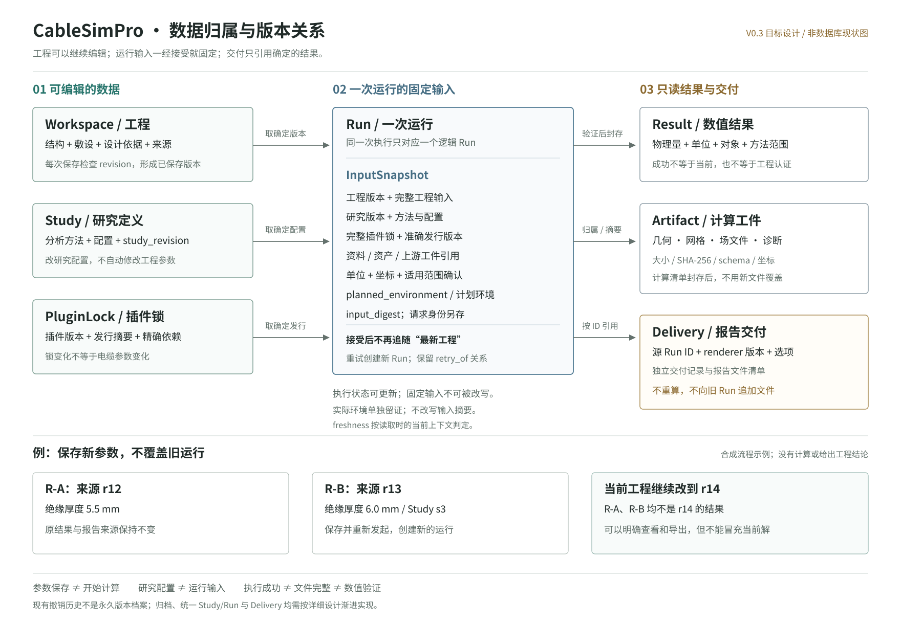
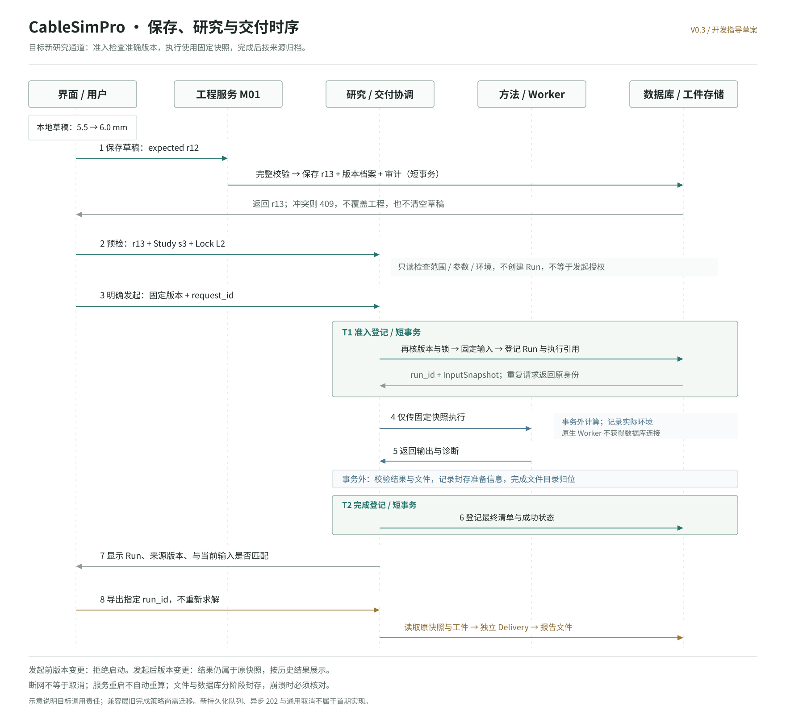

# CableSimPro 模块、数据与执行详细设计

版本：0.3 开发指导细则草案  
日期：2026-09-22  
适用范围：承接 [系统总览](./SYSTEM_ARCHITECTURE.md)，作为模块接口和迁移评审依据；本文件不是已实现 API 文档。本轮根据宿主和 CableModelKit 的固定源码契约补充，不自动升级现有协议。

## 1. 先用一个例子说明

下面是合成流程示例，只解释软件行为，没有计算或声称任何工程数值。

| 操作 | 工程发生什么 | 研究与结果发生什么 |
| --- | --- | --- |
| 打开工程 W，当前 r12，绝缘厚度 5.5 mm | 读取已保存数据 | 可以查看基于 r12 的运行 R-A |
| 将厚度输入为 6.0 mm，尚未保存 | 只修改草稿，数据库仍为 r12 | 禁止用草稿发起计算；R-A 不显示成这份草稿的结果 |
| 保存成功 | 完整校验后生成 r13 | R-A 原样保留，标为历史输入；研究配置不被自动改写 |
| 运行研究 S，配置版本 s3 | 工程仍为 r13 | 创建 R-B，固定 r13 + s3 + 方法版本 + 插件锁 |
| R-B 执行时，另一个窗口保存为 r14 | 新工程为 r14 | R-B 继续使用 r13；成功结果归档为历史结果 |
| 对比 R-A 与 R-B | 不修改工程 | 显示两个运行的输入、方法及边界差异，再显示可比较的指标 |
| 导出 R-A 的报告 | 不切换工程、不回退参数 | 消费 R-A 快照，不能把 6.0 mm 或 r14 混进去 |
| 撤销到以前的参数 | 创建更大的版本号，不将版本号退回 r12 | 不复活旧审批，也不自动将旧结果标为当前 |

**四个基本区别：工程是正在设计的对象，研究是要做的分析，一次运行是固定输入上的执行，报告是对指定运行的交付。**

阅读顺序：

1. [数据关系图](./data-model.svg)：看对象和历史归属。
2. [模块与写入权](#3-模块与写入权)：看谁能改什么。
3. [执行时序图](./execution-flow.svg)：看保存、计算、封存如何衔接。
4. [迁移顺序](#12-迁移顺序与验收)：看哪些现有代码保留，哪些行为需要补齐。

## 2. 现状与目标必须分开

以下“现状”来自固定提交 `a047f84e225a75e784f26a03b932147f066c9825` 的源码核对，不等于所有分支状态。准确出处见文末。

| 主题 | 现状观察 | 目标设计 / 所需改动 |
| --- | --- | --- |
| 工程版本 | `workspaces` 保存当前状态与版本；撤销/重做仍递增 revision | 保留此语义，不把 revision 当历史游标 |
| 撤销历史 | `workspace_history` 按 position 保存；撤销后另作修改会删除后面的重做分支 | 不将其当永久版本档案；新增档案从迁移时刻起记录，不能伪造旧档案 |
| 宿主结果 | `workspace_runs` 保存计算输出；`engineering_tasks` 记录能力调用 | 一次逻辑 Run 关联这两种记录，不在界面列成两次计算 |
| 插件结果 | `plugin_jobs` 记录任务、来源与工件；宿主 façade 又可调用原 runtime | 聚合同一执行的外层插件记录和内层计算结果，不能重复计数 |
| 计算期间改工程 | 插件完成时可标 `stale`；宿主 runtime 完成时仍要求原 revision 匹配 | 新研究通道采用固定快照 + 历史归档；不能只加 UI 标签而不改完成逻辑 |
| 事务 | `WorkspaceStore.calculate()` 在写事务中计算 | 新研究通道拆成准入短事务、事务外计算、完成短事务 |
| 研究定义 | 现有能力入口与插件研究参数并不等于统一持久化 Study | 新增 Study 及其版本；不从历史结果反猜研究定义 |
| 报告 | `reports.render` 按既有宿主 run_id 读取报告数据 | 保留旧能力；新统一研究结果另接有类型的报告入口 |

这不是要求重写全部旧入口。先建立只读兼容视图，随后逐条迁移真实执行流程。

## 3. 模块与写入权

模块编号与系统总览一致。下面的“服务”指职责边界，不要求立刻为每一行创建一个新 Python 类或网络服务。

| 模块 | 对外提供的行为 | 可以维护的数据 | 不能做的事 |
| --- | --- | --- | --- |
| M01 工程 | 打开、保存、锁、撤销、批准提案、导出输入 | 当前 Workspace、工程版本档案、撤销历史、审计、提案状态 | 不运行重型求解，不把旧结果覆盖成新结果 |
| M02 电缆模型 | 校验结构、生成配方、映射语义对象 | 由 M01 提交的结构输入；可生成派生几何 | 不单独存一份“当前电缆”，不直接应用外部模型 |
| M03 敷设环境 | 校验位置和环境、提供方法所需边界 | 由 M01 提交的敷设输入 | 不凭界面选项扩展求解器能力 |
| M04 资产型号 | 查找、审核、发布、引用准确版本 | 独立的材料/资产/型号版本及生命周期 | 不因库升级自动更新已保存工程 |
| M05 资料依据 | 提取、核对、引用、生成参数候选 | 原件、文档版本、提取记录、依据引用 | 不将 OCR/模型输出直接写入参数 |
| M06 研究运行 | 配置研究、预检、提交、查询、比较上下文 | Study、StudyVersion、Run 输入及生命周期 | 不批准参数提案，不把失败计算装成可用结果 |
| M07 结果交付 | 展示、比较、导出指定结果 | 交付记录和报告工件；只读数值结果 | 不重算数值、不原地修改计算工件 |
| M08 插件执行 | 依赖计划、项目启用、准备/执行/校验 | 插件安装状态、项目插件锁、执行记录、作业目录 | Worker 不写工程数据库，不自行升级项目插件 |
| M09 工程助手 | 查询、提案、显式发起已授权能力 | 对话/任务上下文；经宿主创建提案或运行 | 不直接写上述业务表，不批准自己的提案 |

### 3.1 三条写入通道

```text
人工编辑 ─────────────────→ M01 校验 / 版本 / 锁 → 保存新版本
AI、资料、资产、外部建模 → 变更提案 → 人工确认 → M01 → 保存新版本
已保存工程 → M06 → 固定运行输入 → M08 执行 → M06/M07 保存并展示结果
```

图中的 M08 指宿主内的插件服务，它可以维护自己的任务表；原生 Worker 则只能读宿主交付的输入、写指定输出目录。两者不能混称“插件进程”。

### 3.2 只读不是一个含糊标签

- GET 查询和预检：不得创建任务、审批、运行或新工程版本。
- 生成提案：不改工程参数，但会新增提案和审计。
- 发起研究：不改工程参数，但会新增运行和工件。
- 导出报告：不改工程和数值结果，但会新增交付记录或报告工件。
- 安装/启用插件：分别改变安装状态或插件锁，不改变电缆参数。

界面文案、API effect 和审计应表达这些实际副作用，不能将“未改参数”描述成“完全无写入”。

## 4. 数据模型



### 4.1 用户概念与代码概念

| 界面名称 | 代码概念 | 生命周期 |
| --- | --- | --- |
| 工程 | Workspace | 当前设计的根；第一阶段一份工程只有一个当前 Scenario |
| 工程参数 | Scenario | 结构、敷设、运行输入的值对象；不是单独的工程数据库 |
| 草稿 | Draft | 尚未提交的文本和字段修改；带 base_revision |
| 已保存版本 | WorkspaceRevision | 某个 revision 对应的固定状态；不同于撤销 position |
| 研究 | Study + StudyVersion | 方法和配置可编辑，每次有效修改产生新研究版本 |
| 运行 | Run | 固定输入与方法的一次执行；重试是新的 Run |
| 执行步骤 | Job / ExecutorRef | Run 的具体执行记录；近期复用既有任务记录 |
| 结果 | Result | 带物理类型、单位和范围的数值或场摘要 |
| 结果文件 | Artifact | 网格、场、几何等实际文件及摘要 |
| 报告交付 | Delivery | 指定源运行的输出交付，拥有自己的 renderer 与文件清单 |

第一阶段不新增重复的 Project 实体、不假装支持项目内多方案。未来多方案必须增加明确 ID 和授权边界，不能让多个可编辑 Scenario 共用一个 revision。

### 4.2 版本与摘要各管什么

| 字段 | 用途 | 什么时候变化 |
| --- | --- | --- |
| `workspace_revision` | 工程写入冲突控制 | 工程状态有效修改、锁变化、撤销/重做等宿主提交 |
| `study_revision` | 研究配置冲突控制 | 研究配置或明确的方法版本选择改变 |
| `lock_revision` | 本工程插件启用配置的并发版本 | 项目启停/换版改变；单纯保存电缆参数不改变 |
| `lock_digest` | 完整 ProjectPluginLock 的摘要 | 现有协议同时覆盖 project_id、project_revision、lock_revision 和全部 PluginPin |
| `input_digest` | 接受时完整规范输入的内容身份 | 输入、来源、研究、方法或计划环境改变；不包括运行后才知道的实际环境 |
| `environment_digest` | 本次实际执行环境的证据摘要 | 执行时观测所得，不能反向改写 input_digest |
| `release_digest` | 插件发行内容身份 | 不允许同 ID/版本悄悄变内容；变更必须新发行 |
| `artifact_sha256` | 输出文件字节完整性 | 文件字节改变即不再匹配，不能作为合法“更新” |

服务端生成摘要，不相信客户端自报的快照或摘要；沿用既有确定性编码工具。字段集合改变时升级契约版本，不让同名摘要悄悄改变计算范围。

input_digest 覆盖规范输入及其来源身份，不包含 run_id、request_id、状态、进度和时间戳；这些属于运行信封。请求幂等使用独立的请求摘要，不能把“相同物理输入”当作同一次操作。

Run 保存完整锁，不只存一个摘要：`project_id + project_revision + lock_revision + plugins[] + lock_digest`。每个 pin 保留 plugin_id、准确版本、release_sha256、permissions，包含已解析的依赖。工程保存后，即使 lock_revision 不变，现有 lock_digest 也会因 project_revision 变化而变化；不得把它改造成新的“仅插件集合摘要”。

计划环境和输入的摘要采用服务端现有 CSP JSON v1 规则。它不是 RFC 8785 跨语言规范化承诺；浏览器不能自行 JSON.stringify 后充当权威摘要。跨工具交换先规范化并由宿主计算，保留原文件字节摘要作为另一项证据。

### 4.3 运行输入与状态分开

Run 请求一经接受，以下内容固定：

```text
run_id + workspace_id + study_id + client_request_id
workspace_revision + study_revision + method_pin + plugin_lock
完整 Scenario + 设计依据 + 来源/资产引用与可解析内容
研究配置 + 上游工件引用 + 单位/坐标约定 + 范围确认 + planned_environment
input_digest + 创建时宿主版本
```

后续允许更新的是执行状态、时间、进度、诊断及尚未封存的结果。完成后封存结果清单；后续核验发现损坏时记录完整性状态，不改写原始清单或重新计算伪装成原文件。

`planned_environment` 固定本次要求的宿主/适配器版本、平台约束、准确运行包要求及相关协议版本。`observed_environment` 在执行进程内记录实际 Python、平台、适配器和所需库的版本与可取得的构建标识，单独形成 environment_digest，随执行证据封存。

必需运行项缺失或与计划不符时失败，不把目录元数据当成实际加载证据。未完全锁定的传递依赖明确标注，不因此宣称环境可严格重建。比较两次执行时同时看 input_digest、environment_digest 和验证条件；相同输入摘要不能保证结果文件字节相同。

报告来自已有运行，无需重新启动该运行的原求解器；是否还能重算是独立能力。环境后续被移除不抹掉历史观测，只更新环境可用性。

### 4.4 最小增量存储

以下是目标表设计，尚未建表，也不是立即迁移授权：

| 新表 | 主键/约束 | 保存什么 |
| --- | --- | --- |
| `workspace_revisions` | `(workspace_id, revision)` 唯一 | 从启用归档起的完整状态、摘要、时间与操作来源 |
| `studies` | id；关联 workspace_id | 研究标题、current_study_revision、归档标识 |
| `study_versions` | `(study_id, study_revision)` 唯一 | 方法 pin、配置、配置摘要 |
| `study_runs` | id；`(workspace_id, client_request_id)` 唯一 | 固定输入及完整锁、计划环境、执行/结果引用、状态、实际环境、结果清单 |

完整快照可保存在 `study_runs` 的 JSON 字段，不再另造通用“快照服务”。大型文件仍放工件存储。Job 首期只保存对既有 `engineering_tasks` / `plugin_jobs` 的类型化引用，不新增另一套队列表。

外键和归属由数据库约束与服务双重检查。按 workspace/study/created_at 分页查询运行；不能沿用“只返回最近 30 条”作为完整历史接口。

执行记录还保留 owner_epoch、execution_nonce 和可核验的执行器身份，供 §6.5 恢复使用。它们是生命周期元数据，不进入工程物理输入，也不构成一套新增队列。

Delivery 初期可以复用已有任务账本登记其独立输入与工件，不强制新增交付数据库表。它引用 `source_run_ids`、renderer 版本和源摘要，**不是向已封存的数值 Run 追加报告文件**。

## 5. 接口设计

### 5.1 复用与新增清单

| 接口/能力 | 状态 | 用途 |
| --- | --- | --- |
| `POST /api/workspaces/{wid}/edit` | 已有 | 人工保存工程字段，保持完整校验与锁检查 |
| `POST /api/workspaces/{wid}/proposals/{pid}/{decision}` | 已有 | 人工批准/拒绝提案 |
| `POST /api/runtime/{wid}/invoke` | 已有 | 宿主已登记能力调用 |
| `POST /api/plugins/workspaces/{wid}/invoke` | 已有 | 插件已登记能力调用 |
| `GET/POST /api/workspaces/{wid}/studies` | 拟新增 | 列出或新建研究 |
| `PUT /api/workspaces/{wid}/studies/{sid}` | 拟新增 | 带 expected_study_revision 更新研究配置 |
| `GET /api/workspaces/{wid}/studies/{sid}/preflight` | 拟新增 | 核对指定工程/研究/锁的只读预检 |
| `GET /api/workspaces/{wid}/studies/{sid}/runs` | 拟新增 | 统一运行视图；游标分页 |
| `GET /api/workspaces/{wid}/studies/{sid}/runs/{rid}` | 拟新增 | 读取确切运行及其类型化来源 |
| `studies.run` 能力 | 拟新增到既有 runtime | 通过研究协调服务发起已保存研究 |
| `reports.render-study` 能力 | 拟新增到既有 runtime | 导出统一 Run；旧 `reports.render` 的 run_id 语义不变 |

这些是评审用接口，不可当作现在可调用的 API。暂不增加任意脚本、任意 URL、任意文件路径或通用 SQL 接口。

### 5.2 保存工程：沿用现有请求形状

```json
{
  "expected_revision": 12,
  "changes": [
    {"path": "cable.insulation_mm", "value": 6.0}
  ],
  "label": "调整绝缘厚度"
}
```

成功返回已保存 Workspace 与新 revision。版本冲突返回 409；字段/跨字段校验失败返回 422；**两者均不能清空客户端草稿**。只改标题等非求解字段也先按现有保守版本规则处理，不在首期引入复杂的字段依赖缓存。

### 5.3 发起研究：目标请求

下面 ID 是说明用标识，非可直接执行的请求。`lock_digest` 必须是服务端查询返回的准确值。

```json
{
  "capability": "studies.run",
  "request_id": "<new UUID>",
  "expected_revision": 13,
  "arguments": {
    "study_id": "<saved Study UUID>",
    "expected_study_revision": 3,
    "lock_digest": "<server-issued digest>",
    "scope_acknowledged": true
  }
}
```

客户端不能在这里再提交一套 Scenario、另一个求解器命令或任意热源文件。方法、配置和输入由宿主读取已保存版本后固定。

`scope_acknowledged` 只确认本次已展示的适用范围，不授予工程审批权。它与明确的工程/研究/方法/锁版本一起校验；版本变化后重新确认。

同 request_id 的合法重放可以读取原状态，即使工程后来变化，也不能重新执行或把原结果标成当前。同 ID 不同请求返回 409。输入检查未通过时不启动 Worker；若兼容层已有失败调用账本，原样保留。

### 5.4 不能只给能力字典增加一行

现有 runtime 的完成检查会拒绝工程版本变化。`studies.run` 必须有宿主控制的“固定快照完成策略”，并把准入登记收敛到同一事务；不能用客户端参数跳过版本检查。

- **准入**：仍严格检查当前工程/研究/插件锁，防止错误输入启动。
- **执行**：适配器只接收被接受的快照；不得拿 workspace_id 再读取最新参数。
- **完成**：允许保存来源已变旧但确实完成的结果；仅新研究通道采用此行为。
- **旧能力**：在完成各自回归前保持现有语义，不全局关闭 CAS。

目标适配接口只有三段职责：`prepare(snapshot, method)`、`execute(prepared_input)`、`validate(output)`。它们是宿主内部接口，不是插件作者可传入的可执行字符串。内建热网络复用现有 `engine.calculate()`，不是复制公式。

### 5.5 领域模型到分析输入

```text
Workspace / Scenario                可编辑的设计意图
    → InputSnapshot                 本次已确认的事实与假设
    → 方法特定的 PreparedInput       单位、材料、域、边界和热源已绑定
    → Result + ExecutionEvidence    对应本次输入的输出与诊断
```

不是把所有方法压进一个不断添加可空字段的 Scenario：

| 项目 | 准备阶段明确绑定 | 不允许的隐式行为 |
| --- | --- | --- |
| 几何 | 配方/原生工件版本、语义 UID、分析简化 | 从当前画布截图或显示网格猜分析几何 |
| 材料 | 域到材料版本/属性、单位、适用条件 | 按名称、颜色或默认“铜”补全物性 |
| 边界 | 稳定对象/域选择、边界类型及数值 | 用旧 CAD 面序号套到重建后的模型 |
| 热源 | W/m、W/m³ 或损耗模型的准确含义与归一化 | 把每米功率直接当体积发热率 |
| 坐标 | 维数、长度单位、轴向和转换记录 | 将局部轴、重力和埋深方向混用 |
| 上游工件 | 来源 Run、schema、摘要与输入关联 | 默认拿“最新文件”或客户端路径 |

PreparedInput 是固定快照的派生物，记录准备适配器版本及摘要。材料或几何选择解析失败必须阻止求解。几何重新生成后重新解析语义映射，不能缓存临时拓扑编号继续运行。

宿主先提供“热网络”“固定功率直埋 FEM”等具体类型的准备器；后续电热或新工况增加新契约。只共用确实一致的 Quantity、AssetRef、文件和来源类型，不提前构造万能求解器。

多步骤方法采用宿主审核的固定计划，逐步保存明确的输入/输出引用。计划内沿用接受时的快照，不在中间步骤重新读取当前工程；未迁移的旧插件接口仍按原 stale 检查拒绝，不能偷偷放宽其来源策略。

## 6. 执行时序与事务



### 6.1 保存事务

同一短事务内完成：读取并核对 revision → 字段/几何/锁校验 → 写当前状态 → 追加版本档案 → 更新撤销历史与审计。全部成功才返回新版本。

所有写入路径都需要覆盖，包括创建、人工编辑、批准提案、锁和撤销/重做；不能只在 `edit()` 里归档。无实际字段差异时沿用现有无变更行为。

### 6.2 研究准入 T1

在同一短事务中：

1. 先识别请求重放，避免重复创建 Run。
2. 核对 workspace_revision、study_revision、锁摘要与方法适用条件。
3. 固定工程、配置、引用及上游工件身份；写 Run 输入和待执行状态。
4. 登记准确的执行引用，提交事务。

动态库可加载性/环境探测可先在事务外检查；T1 核对其环境/发行身份，执行前再次验证不可变清单。哈希大文件和导入重型库不在 SQLite 写事务中进行；环境变化则失败，不换用别的库版本。

### 6.3 执行与封存 T2

```text
事务外执行
    → Worker 正常退出
    → schema / 单位 / 输入绑定 / 网格或结果契约校验
    → 作业暂存文件验证与文件清单
    → 准备完成记录（短事务）
    → 同文件系统工件目录归位
    → T2 登记最终清单与成功状态（短事务）
```

计算成功但缺文件、返回非有限数、输入绑定不符或 Worker 非零退出，都不能进入 succeeded。部分扫描点失败按该方法的类型化结果表达，不用总体成功掩盖失败点。

文件系统与数据库无法共用原子提交。准备记录至少包含 run_id、暂存位置、预期最终位置和清单摘要。崩溃后按实际文件与数据库状态核对；只有两者都可核验才完成封存。无法确认则标中断/待恢复，不自动重算、删除或伪造成功。

### 6.4 近期执行与后续队列

第一阶段保持请求内等待的执行方式，只拆清输入和事务；**不先引入 202、持久化队列或通用取消按钮**。待可靠调度、服务重启和任务查询能力完成后，再增加异步提交。

目标状态迁移在统一视图中表达为：

```text
accepted → running → validating → succeeded
    │          │          └────→ failed / interrupted
    │          └───────────────→ failed / interrupted
    └──────────────────────────→ interrupted（未能确认已启动）

后续支持取消的方法：
accepted → cancelled
running → cancel_requested → cancelled（确认进程结束后）
```

取消与完成发生竞争时由宿主状态更新做一次确定裁决：先确认成功则返回已完成；先确认取消则不再发布成功结果。网络断开或发送信号都不等于已取消。

### 6.5 单机所有者与启动恢复

持久化运行记录不等于持久化调度队列。首期采用一个宿主进程持有数据目录的独占所有权；多标签页可以访问同一宿主，不能启动多个独立宿主同时管理其 Worker。

- 启动时取得目录级所有者锁并生成 owner_epoch；拒绝第二个所有者，不能仅凭端口不同认定安全。
- 运行登记 execution_nonce、执行器身份、独立目录和阶段。原生进程身份需结合进程创建时间/所有者信息，不能只存 PID。
- 服务重启先核对本机执行器和封存记录，不重新派发已有 request_id。
- accepted 且能证明未启动的记录，转 interrupted；running 但无可信完成证据的记录，同样记录 interrupted 及具体原因。
- interrupted 只表示不能确认已完成，不表示旧进程已经终止。残留进程未确认退出时，阻止该运行的重试、发布和清理；不猜 PID 强制终止。
- validating 且有完整准备记录、文件和环境证据的，按恢复规则完成封存；证据不足则保留隔离目录并标明待恢复，不补猜成功。
- 恢复动作自身需幂等：多次启动核对不能生成第二条运行或重复应用工程修改。

原生进程的父子生命周期约束和强制终止需在目标 Windows/Linux 环境验收。未完成前，不提供“可靠后台运行”或“通用取消”承诺；不为此先引入分布式 lease/heartbeat 系统。

## 7. 结果怎样算“当前”

### 7.1 四个独立问题

| 维度 | 可用值/表达 | 含义 |
| --- | --- | --- |
| execution_status | accepted / running / validating / succeeded / failed / interrupted 等 | 执行到哪一步 |
| freshness | current / historical / unknown | 是否与当前保存的工程、研究、方法和插件锁匹配 |
| integrity | verified / unverified / missing / corrupt | 结果元数据和必要文件是否可核验 |
| verification | 验证方法、条件、观察、限制 | 是否有适用的数值/外部证据，而不是一个笼统绿灯 |

`freshness` 是读取时相对于当前上下文计算的值，不应永久写成“永远 current”。Run 保留原始来源和完成时信息。

精确来源匹配元组为：`workspace_id + workspace_revision + study_id + study_revision + method_pin + lock_digest`，再核对当前规范输入摘要。目标元组改变时即为 historical；缺少可核对来源时为 unknown，不猜 current。原观测环境后续不可用，影响“能否按原条件重算”，不改写原来源；若方法升级改变了计划环境要求，则按新输入重新比较。显示环境差异而不是删除历史。

当前结果的保守判定还要求输入证据齐全、执行成功及所需输出完整。即使数值输入碰巧相同，撤销后更高的 revision 也先视为历史，不自动复用。缓存等价性是后续单独设计。

草稿是另一个 UI 状态：数据库结果仍可能匹配已保存版本，但界面必须说明“有未保存修改，所示结果对应已保存输入”，不能称其为当前草稿结果。

### 7.2 关键情况决策表

| 情况 | 工程写入 | 原运行处理 | 新运行/报告处理 |
| --- | --- | --- | --- |
| 草稿非法 | 不提交 | 保留原结果，明确来源 | 阻止新运行，定位字段；可明确导出已选历史运行 |
| 保存冲突 | 409，不覆盖 | 不修改原结果 | 读取新版本后人工协调草稿 |
| 发起前工程/研究/锁改变 | 不改参数 | 不影响旧运行 | 拒绝启动，要求重新预检/确认 |
| 已接受后工程改变 | 允许另一条合法提交 | 成功结果归档为 historical | 不作为当前参数的结论 |
| 已接受后研究配置改变 | 不改工程参数 | 原 Run 继续使用旧 StudyVersion | 新执行采用新研究版本 |
| 已接受后插件升级/停用 | 锁变化不改电缆 | 不热切换运行中代码；新旧状态按来源判断 | 运行、停用、卸载和历史保留按 §11.4 处理 |
| 同请求网络重试 | 不改工程 | 返回原执行身份 | 不再启动第二次计算 |
| 服务重启 | 不改工程 | 无法确认完成的任务标 interrupted | 用户明确重试，新 request_id/new Run |
| 工件损坏 | 不改参数和原始清单 | integrity=corrupt；错误不能被“成功”遮盖 | 阻止依赖它的研究和完整报告导出 |
| 外部资产发布新版 | 不自动更新引用 | 旧输入/结果仍指向原版本 | 更新资产须形成新工程变更 |

### 7.3 比较与报告

先检查可比性：物理量定义、单位、相位/对象标识、模型用途、源热功率或运行电流，以及边界条件。不同方法可以并排作方法对照，但必须标注差异，不能默认解释为“优化收益”。

同一物理量支持显示原始绝对差。百分比只对有意义的比值量使用，基准为零时显示不可定义；绝对温度显示温差或温升对比，不对摄氏温度直接计算“改善百分比”。不同网格不得直接按数组下标相减；节点对齐、坐标变换或重采样必须是显式的后处理研究并记录方法。

报告输入为：源 Run ID 列表、renderer 精确版本、展示选项。保存 Delivery 自身的输入摘要和输出清单，数值来源仍指向原 Run；不要改写原计算完成时间或输入。

未保存草稿不进入报告。切换工程后不能把之前点击的导出请求重新绑定新工程。参数、图和表必须取同一来源集合；缺失关键工件时返回缺失清单，而不是用当前画面或占位图代替。

## 8. 前端状态与页面责任

保留一个 StudioProvider 作为工程交互入口；研究与结果组件通过宿主查询加载其确定对象，不另造一份可编辑 Scenario。

| 前端状态 | 唯一来源 | 是否持久化到业务数据库 |
| --- | --- | --- |
| workspace / revision / locks | 服务端 Workspace | 是 |
| drafts / base_revision / 字段错误 | 共享草稿状态 | 首期否；刷新丢失须明确提示 |
| selected_object / open_documents / 视图姿态 | UI 会话状态 | 否；可保存非敏感 ID/布局 |
| selected_study / study_version | 已保存 Study；未保存配置单独标记 | 已保存部分是 |
| selected_run | 明确 run_id 的查询结果 | 是；不等于“最新一次结果” |
| can_run / currentness | 从以上状态派生 | 不作为另一份真值持久化 |

跨页草稿保留与刷新恢复不是同一能力。首期不通过 localStorage 暗中持久化完整工程或结果。

### 8.1 四类文档

- **模型文档**：对象树选择层或敷设后展示对应字段。有效草稿可以作为明确标注的展示预览，但不能成为分析输入。
- **研究文档**：方法、范围、输入来源、配置、预检和发起按钮。方法选择变化不能保留上一个方法的结果当本方法结果。
- **结果文档**：只读展示固定 Run；输入、结果、工件、诊断和验证分区，不显示可编辑当前工程表单。
- **对比/交付文档**：明确源 Run 集合和差异；不借切换标签触发求解。

“保存工程”和“保存研究配置”分别更新自己的版本；运行前提示具体哪一项未保存，不提供语义模糊的“保存所有并直接算”。

## 9. CableModelKit 与资产接入细则

本轮新增源码依据：CableModelKit 开发提交 `a4eb1e869d7a3a78e949da5ac757be22a3c7633a`。已读 Core schema/exporter 与相关扩展说明，未运行导出或验证其 CI。README 包含多代版本叙述，接口设计以该固定提交的对应 schema/实现为准。

### 9.1 接受什么工件

Core 的 `export_bundle()` 写出 bundle_version 1.1 的 `asset.json`，包含文件清单、插件/运行版本、域/界面、单位、坐标、假设及资格状态；`request.json` 保留参数历史所需输入。宿主必须保留二者，不能只导入 STEP 后声称保留了模型语义。

交换过程为“读入 → 校验 → 映射 → 审查 → 应用”，不建立双向实时同步。映射输出至少包含：

| 项 | 示例/处理 |
| --- | --- |
| 来源身份 | source_model_id、导出格式版本、源文件摘要 |
| 字段映射 | source_uid → target_path、原值/单位、转换后值/单位 |
| 几何用途 | display / design / analysis；原始模型与分析简化分别保存 |
| 不支持内容 | 多芯/非圆截面等不能套当前模型的结构 |
| 缺失/冲突 | 来源与现有 R20 不一致、材料无来源、厚度信息不完整 |
| 应用提案 | base_revision、完整候选、差异、信息损失与警告 |

不得因为源材料名字是“铜”就套入某个厂家物性版本；没有材料映射就保持缺失并说明限制。不支持的结构可以保留为来源附件，但不能生成“已成功应用”的假工程。

用户批准时再次核对源包摘要、提案期限、工程版本、锁、目标字段和完整 Scenario。这里沿用 M01 的原子提交，不在建模适配器内写工程。

### 9.2 真实契约映射

| CableModelKit 源语义 | CableSimPro 接入规则 |
| --- | --- |
| 请求长度为 m；STEP/BRep 为 mm；GLB 为 m | 按每种工件声明转换一次，保留原文件；不能全包统一乘一个系数 |
| 默认直线构件局部 +Z 为轴向；GLB 为 Y-up | 保存显式坐标变换，不把局部轴当重力或宿主埋深轴 |
| Core 记录 CAD 到 GLB 的坐标变换 | 显示适配尊重该记录，不能二次换轴/缩放 |
| conductor.radius_m 为几何半径 | 不能仅由半径反推金属面积；宿主 area_mm2 与 fill_factor 需要来源或明确输入并校验一致性 |
| 构件 length_m 为几何轴向长度 | 不赋给线路 circuit_length_m；宿主 R2 的 1 m 截面构建长度也不是线路长度 |
| cable_group.surface_gap_m 是表面净距 | 只在相同圆形电缆等适用条件下，用外径和净距转换中心距；不直接赋给 spacing_m |
| material_ref 是模型材料标识 | 映射到宿主准确资产版本/物性；未映射保持缺失 |
| sheath 等角色与宿主 jacket 等名称不同 | 按语义和受支持结构建立显式映射，不按字符串相似度自动应用 |
| geometry_key / artifact_key | 保留源身份；宿主仍核验实际文件摘要，不承诺重复导出字节相同 |

### 9.3 几何、网格与求解分级接入

1. **只读模型资产**：检查 manifest 和文件、显示模型与限制，不改变工程。
2. **受支持结构的参数提案**：先验证六层同心单芯子集；额外层、非圆或多芯不静默丢弃。
3. **分析工件**：单独核对拓扑、域映射、单位、材料和边界后，才能交给声明兼容的方法。

Core 导出标识 coincident-unmerged，不能直接当共形 FEM 网格。simulation-prep 的 `.msh` 坐标明确为 mm；Physical Group 保留只证明域标识传递，不证明网格质量或共享拓扑。其后续 topology/thermal 扩展各有独立契约和限制，不能把某个受控热基准的通过扩展到任意电缆工况。

首批适配夹具：可无损映射的六层结构；缺材料/R20 或缺 fill_factor 的结构；带额外层/不支持几何的结构；单位/坐标元数据不一致；文件被替换。每类都检查原件保留、明确拒绝或完整提案，不只检查模型“看起来像”。

资产版本保留和清理规则统一见 §11.4，不在导入器中另建删除策略。

## 10. 现有记录怎样接入

### 10.1 统一列表不等于立即搬表

| 旧记录 | 新视图中的定位 | 处理要求 |
| --- | --- | --- |
| `workspace_runs` | 宿主计算的结果来源 | 保留原 ID 和输入/输出，不凭缺失信息补齐历史 |
| `engineering_tasks` | 调用及执行上下文 | 读取结果中的确切 run_id 关联宿主结果；读操作不包装成数值 Run |
| `plugin_jobs` 原生计算 | 插件运行与工件来源 | 以 workspace + job_id + plugin pin 确定身份 |
| `plugin_jobs` 宿主 façade | 外层插件执行记录 | 展开其宿主结果引用，和内层记录合成一条逻辑运行 |
| `workspace_history` | 可撤销的编辑历史 | 不能按 position 推算永久 revision |

只有存在明确引用才聚合，不按“时间接近、名字相同、结果数值相同”去重。无法关联的记录保留为旧记录，不隐藏。

旧结果能读取但证据不完整时，展示 `freshness=unknown` 和缺失项；可以看原报告，但不允许把它当作完整新快照重放。来源完整性和文件完整性分别显示。

### 10.2 旧 stale 与旧失败

插件 stale 记录有结果并不自动意味着可以映射成功：需检查原执行完成证据、结果 schema 和文件清单。满足条件才映射为 `succeeded + historical`。

宿主任务可能完成部分结果写入后，外层版本检查失败。旧视图保留原失败状态及已有结果引用，不把它静默改成成功，不自动重新计算。新“固定快照完成”策略只对完成迁移的执行通道生效。

### 10.3 旧入口迁移矩阵

| 既有入口 | 对新对象的影响 | 迁移责任 |
| --- | --- | --- |
| Workspace 创建、edit | 新建/更新工程版本 | M01 同事务追加档案；有效提交不漏归档 |
| lock、history/undo/redo | 工程 revision 变化 | 同样经过归档，不把历史 position 当 revision |
| proposals/.../approve | 提案状态与工程变更 | 批准、状态和档案原子提交；重型研究逐步拆出批准事务 |
| runtime 的 analysis.buried / Workspace calculate | 宿主旧任务和结果 | 已迁移调用关联一个规范 Run；未迁移保留旧视图，不冒充新语义 |
| plugins/.../invoke | 插件 job，可能再调用宿主 façade | 类型化关联内部结果；不再次创建同义数值 Run |
| reports.render | 旧 workspace_run 报告 | 保持原 ID；新研究采用独立 render-study 入口 |
| `/api/calculate`、`/api/sweep`、`/api/report` | 早期无工作区快照的计算/重算报告 | 与新工作流隔离；不能作为专业工作流的绕过入口 |
| `/api/projects` | 早期 ProjectStore，不等于 Workspace | 保留旧资料；显式导入创建 Workspace，不按同名/ID 自动合并 |

工程归档不变量限定于受管理的 Workspace：任意成功状态变更都必须有同 revision 档案。规范 Run 也只对已迁移的执行通道要求完整快照；旧数据缺来源不补造。这样避免“保留所有旧路由”与“所有接口已经统一”同时成立的假象。

迁移评审必须列出哪些路由已接入、哪些仅保留旧版用途。新默认工作流不得调用无版本计算或重算报告；切换到正式默认入口前关闭或完成这些旧入口的专业用途迁移，同时保留必要的旧数据读取/导入。不能只改前端按钮。

## 11. 实现落点

下面是职责落点，不是要求现在移动目录：

| 内容 | 优先落点 | 保持不动的部分 |
| --- | --- | --- |
| 工程保存与版本档案 | `workbench.py` / `sqlite_workspace.py` | Scenario 校验、参数锁、人工审批语义 |
| 研究配置与规范 Run | 拟新增小型 `backend/studies/` | 不另建通用 workflow 引擎 |
| 新能力路由与完成策略 | `runtime.py` / `nonblocking_runtime.py` | 原能力默认完成规则，逐项迁移 |
| 快照计算适配 | 研究服务调用 `engine.py` / 已有插件 adapter | 数值公式和已验证的场契约 |
| 原生任务与发行校验 | `backend/plugins/` | 不新增第二套 PluginService |
| 研究文档与运行详情 | 现有 workflow 工作区内增量组件 | StudioProvider、原模型视图、共享草稿 |
| 交付 | `report.py` 与登记的 renderer adapter | 旧 HTML 快照报告语义 |

建议 `backend/studies/` 首期只拆四项：契约、存储、协调服务、路由/能力接入。确有多个方法适配复杂度后再拆 adapter 文件，不提前创建几十个空模块。

### 11.1 契约版本不能混用

现有 R2 `csp-study/0.1` 是声明式 build_only 预检包，固定输出几何配方和问题；它不是拟新增的持久化 Study，也不是完整数值输入。保留旧包，另定义新的 Study/Run schema，复用底层 Quantity/AssetRef/PayloadFile。建议名称为 `csp-study-definition/1` 与 `csp-study-run/1`，本轮尚未发布。

分别记录宿主 API、领域 schema、物理方法、插件发行和原生库版本。物理假设或算法结果语义改变，需要新方法版本和对应基准；不能只改界面版本。

模型普遍拒绝未知字段，因此“只加一个可选字段”不自动意味着所有旧消费者兼容。每次变更用旧/新输入夹具测试：支持则明确兼容，不支持则给版本错误或通过显式转换产生新对象。原始档案与摘要不重写。

### 11.2 发布、升级与回滚

- 选择准确集成 commit 和测试基线；不以 PR 文案中的旧通过声明代替当前验证。
- 数据库使用单独 schema_version 管理。应用拒绝打开比自己支持范围更新的库，不能继续写入。
- 升级前停止所有者进程及其 Worker，制作包含数据库、工件和引用资料的一致性备份；从副本演练升级和恢复。
- 数据变更先做增量表/字段和旧视图兼容；记录迁移起始 revision，旧档案缺口保持显式。
- 程序回滚不等于数据库回滚。旧程序不能写新 schema；需要恢复完整备份或已验证的逆向迁移，不能只复制一个 sqlite 文件覆盖。
- 只有从确切源码构建且契约、数据迁移、目标平台原生流程与受影响 UI 通过后，才切换默认入口；不绑定未经定义的任意测试数量。

### 11.3 本机部署与扩展触发点

首期一个本机宿主管理一个数据目录，前端和 API 同源；原生 Worker 不直接连数据库。数据库与作业目录放本地文件系统，活跃数据库不放共享网络盘或同步盘供多机同时使用。

SQLite WAL 官方约束是同一宿主访问，且同一时刻只有一个 writer；不能把开启 WAL 当作多机数据库方案。项目需验证 WAL、busy timeout、外键启用和 durability 配置，并记录实际运行库版本；不把安装了某 Python 版本等同于 SQLite 运行版本。

只有出现明确需求才扩展：多人服务引入身份/权限与服务端数据库评审；远程 Worker 引入调度所有权与可信传输；大规模工件引入对象存储；公共插件引入签名/撤回/沙箱。当前不预建这些系统。

### 11.4 引用保留、停用和清理

| 动作/状态 | 新执行 | 既有运行/历史 |
| --- | --- | --- |
| 插件 installed | 不等于项目已启用或环境可运行 | 保留发行清单 |
| 项目 enabled / pinned | 按准确锁和环境检查执行 | 接受时复制完整 pin 与要求 |
| 项目 disabled / 普通升级 | 后续按新锁；旧版本不自动替换 | 已接受执行继续用固定版本，不热切换 |
| 发行 revoked（如安全撤回） | 即使旧项目仍 pin，也阻止新执行并说明原因 | 保留来源；运行中的处置单独处理，不能隐瞒风险或伪称已取消 |
| uninstall | 被项目启用、安装依赖或运行占用时拒绝 | 卸载不是删除 Run、工件、资料或发行清单 |

历史结果的读取不应要求原求解器还能导入。移除原生环境会影响重算能力，必须明确提示并单独记录，不改写当时的执行证据；也不要求无限期保留每套可执行环境。

工程和 Run 的引用闭包应保留准确资产定义与参数、必要来源版本，以及有权保留的文件内容或宿主受控的不可变引用。只有外部 URI/文件名/摘要不足以保证重算；不能保存内容时标明来源可用性和重建限制。

资产 deprecated/revoked 禁止或限制新的采用，但不静默替换旧引用。当前阶段不提供自动物理清理；将来清理必须区分项目 pin、历史引用和运行占用，先列明将损失的读取/重算能力，再由用户明确操作。孤立临时目录也不能因“看起来过期”自动删。

文件工件路径由宿主分配；复制/导入后重新核验大小、摘要和归属。先保留原件再生成转换产物，不在源工件上就地改单位或坐标。

## 12. 迁移顺序与验收

| 切片 | 先实现什么 | 必须验证的具体行为 |
| --- | --- | --- |
| D0 固定基线 | 源码、接口清单、旧数据副本与运行环境 | 能重建选定基线；保留现有用户数据；明确未通过的项目 |
| D1 统一只读运行视图 | 旧记录关联与来源展示 | 同一次 façade 调用不重复出现；缺来源明确标未知；读取不写工程 |
| D2 工程版本档案 | 所有工程提交路径原子归档 | 撤销后另存不丢永久档案；旧档案缺失不伪造；失败事务不留半条记录 |
| D3 研究定义与预检 | Study/版本、方法绑定、只读预检 | 改研究不改工程；未保存输入阻止发起；方法不适用有字段级原因 |
| D4 快照执行闭环 | 先热网络，再固定功率 FEM | 同键不重复；计算时改工程仍保存正确历史结果；计算期间不持有长写事务 |
| D5 比较与交付 | 选定运行对比、独立 Delivery | 历史报告输入/图表一致；不触发求解；损坏工件阻止完整交付 |
| D6 复杂方法与建模适配 | 电热、校核、CableModelKit 样例逐项接入 | 原有方法回归、正确来源依赖、映射拒绝与批准后应用 |

每个切片先在独立测试数据库和固定源码上验证，再讨论进入默认入口。旧接口迁移期保留，但不能让旧写入口绕过新增的版本归档；数值公式不跟着 UI 重构一起更改。

最小验收序列：

1. r12 修改厚度保存 r13，刷新后输入一致。
2. 另一个窗口改成 r14，旧草稿保存失败且仍保留。
3. 新研究运行使用已确认的 r14；期间保存 r15，结果只归属 r14。
4. 重放同 request_id，确认仅有一次真实求解。
5. 同屏对比两个指定运行，输入和方法差异可见。
6. 导出较早运行，确认报告没有 r15 参数且没有新增数值计算。
7. 篡改测试工件，查询/下游/报告明确失败；未受影响的工程和历史仍可打开。

这些是目标验收用例，本轮未修改业务代码、未执行上述应用测试。

发布前再补三组跨模块用例：所有旧 Workspace 写入口的档案覆盖；服务崩溃的“未启动/执行中/已归位未登记”恢复；插件环境移除或资产来源不可用后的历史查看与重算限制。每组保留明确输入和故障点，不以全局绿色状态代替实际断言。

## 13. 可选语义判断服务（Jev）

状态：后续候选，默认关闭；未安装、未配置密钥、未调用付费 API。不是当前闭环的前置依赖。

候选能力限定为 M05 的资料参数候选筛选和 M09 的意图分类；必要时标记解释文字与引用可能不一致。它不能选择未经用户确认的计算方法、批准变更、解除锁或判断工程安全。

接口不命名成只能用 Jev 的业务模块，而是由现有 provider 层提供受限判断适配器：

```text
本地解析/检索得到候选 ID 与原文
    → 最小化状态 + 固定问题/选项
    → 可替换语义 provider
    → 标签 / 概率 / 候选 ID / 模型与规则版本
    → 本地验证候选集合及来源
    → 显示建议，人工核对；或生成待批准提案
```

- 数字与单位取自保留原文，经确定性代码校验，不让模型凭空补物性。
- 未配置、超时、服务错误、返回未知候选或把握不足时，返回“无建议/需人工核对”；不默认通过、不自动批准、不静默切换付费 provider。
- 外发前按现有同意规则处理；只发送所需片段，默认不上传整份企业资料、凭据或完整工程。设置在服务端，Worker 和报告不获得 API Key。
- 决策记录区分概率、confidence 和评分，保存所用模型、问题/选项规则版本、候选来源摘要与输出；这些不是物理验证证据。
- 不提前写死 0.9 等阈值。用匿名/脱敏中文电缆样例评估错型号、错行、单位歧义及不支持输入；先在不自动应用的模式下比较误选和人工复核成本。
- 来源文本可能包含诱导内容。权限、版本、输入范围和审批由宿主代码决定，模型高把握也不能绕过。

本轮不保证模型可固定版本、数据保留条款或服务可用性；正式接入前再核对供应商实际接口、计费和数据政策。通用 AI 分数不能升级为厂家数据核对或工程认证。

## 参考原文与范围

源码参考固定为 `a047f84e225a75e784f26a03b932147f066c9825`，以函数名定位，不把本地删除状态解释为远程源码不存在。

- [workbench.py](https://github.com/luohui1/CableSimPro/blob/a047f84e225a75e784f26a03b932147f066c9825/backend/workbench.py)：`initialize`、`commit`、`calculate`、`history`、`review`。
- [sqlite_workspace.py](https://github.com/luohui1/CableSimPro/blob/a047f84e225a75e784f26a03b932147f066c9825/backend/sqlite_workspace.py)：连接/事务及 `stage_and_finish_task`。
- [nonblocking_runtime.py](https://github.com/luohui1/CableSimPro/blob/a047f84e225a75e784f26a03b932147f066c9825/backend/nonblocking_runtime.py)：`invoke` 的登记、处理器和完成版本检查。
- [runtime.py](https://github.com/luohui1/CableSimPro/blob/a047f84e225a75e784f26a03b932147f066c9825/backend/runtime.py)：能力目录、报告读取、路由。
- [plugins/service.py](https://github.com/luohui1/CableSimPro/blob/a047f84e225a75e784f26a03b932147f066c9825/backend/plugins/service.py)：`_register`、`_worker`、`_finish`、`invoke`、`artifact`。
- [plugins/router.py](https://github.com/luohui1/CableSimPro/blob/a047f84e225a75e784f26a03b932147f066c9825/backend/plugins/router.py)：真实插件端点。
- [foundation/contracts.py](https://github.com/luohui1/CableSimPro/blob/a047f84e225a75e784f26a03b932147f066c9825/backend/foundation/contracts.py)：单位、CSP JSON v1、资产引用与几何配方。
- [foundation/study.py](https://github.com/luohui1/CableSimPro/blob/a047f84e225a75e784f26a03b932147f066c9825/backend/foundation/study.py)：既有 build_only 预检包，不能直接当持久化研究契约。
- [plugins/contracts.py](https://github.com/luohui1/CableSimPro/blob/a047f84e225a75e784f26a03b932147f066c9825/backend/plugins/contracts.py)：ProjectPluginLock 的真实字段与摘要。
- [CableModelKit schema](https://github.com/luohui1/CableModelKit/blob/a4eb1e869d7a3a78e949da5ac757be22a3c7633a/src/cable_modelkit/schema.py) / [exporter](https://github.com/luohui1/CableModelKit/blob/a4eb1e869d7a3a78e949da5ac757be22a3c7633a/src/cable_modelkit/exporters.py)：真实输入与 bundle 契约。
- [CableModelKit simulation-prep](https://github.com/luohui1/CableModelKit/blob/a4eb1e869d7a3a78e949da5ac757be22a3c7633a/extensions/simulation-prep/README.md) / [thermal-tetra-solver](https://github.com/luohui1/CableModelKit/blob/a4eb1e869d7a3a78e949da5ac757be22a3c7633a/extensions/thermal-tetra-solver/README.md)：网格单位、拓扑和受控基准范围；本轮未重跑。
- [SQLite WAL 官方说明](https://sqlite.org/wal.html)：同机访问和单 writer 边界。
- [Jev 官方文档](https://docs.typesafe.ai/) / [候选值筛选](https://docs.typesafe.ai/cookbooks/pre_parsed_value_extraction_cookbook) / [模型限制](https://docs.typesafe.ai/model-jaggedness/jev-1.13)：候选集成依据，不是项目效果验证。

外部建模契约已读，但真实导出样例运行、企业权限、公网部署和完整标准算法不在本轮验收范围。没有把源码阅读视为运行、数值或浏览器验证。
