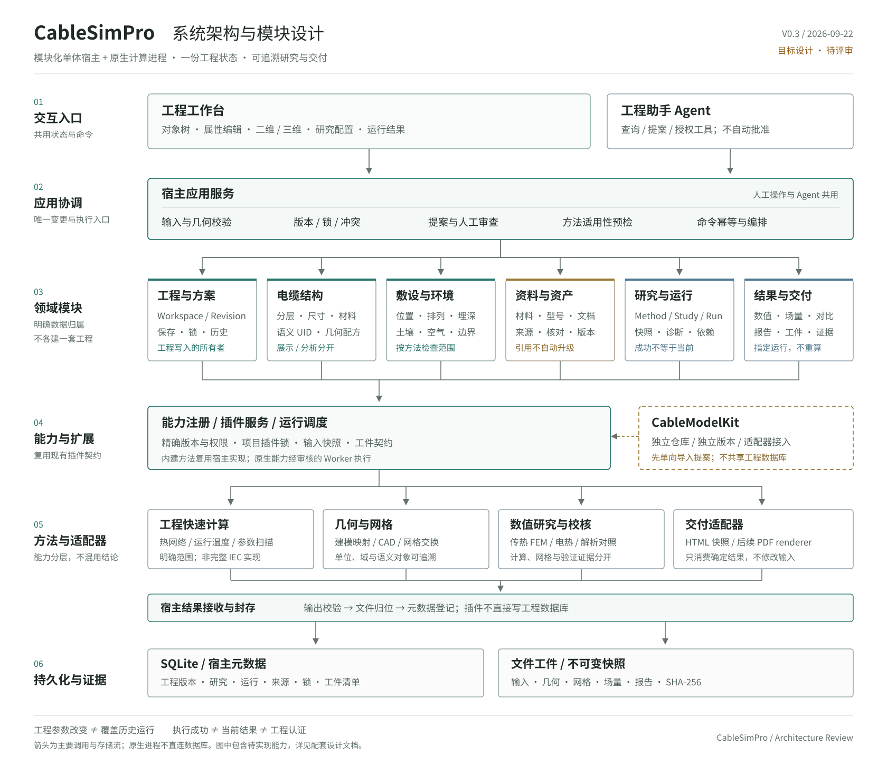

# CableSimPro 系统架构与开发指导

版本：0.3 指导方案草案  
日期：2026-09-22  
用途：作为后续模块设计、接口实现和迁移评审的共同依据。不代表所有功能已经实现，也不授权直接合并分支、迁移数据库或删除历史数据。



[PNG 总图](./system-architecture.png) · [可编辑 SVG](./system-architecture.svg) · [详细设计](./MODULE_DESIGN.md)

[产品需求与分期规划（PRD）](../product/PRD.md) 定义用户目标、功能优先级和产品验收；本文及实施细则定义技术实现约束。两者冲突时评审并同步，不隐式改变工程安全与数据保留边界。

## 1. 产品和仓库边界

**CableSimPro 是工程宿主；CableModelKit 是独立建模产品；Jev 是可替换的候选判断服务。宿主不内置算法，所有计算方法都是插件。**

主流程：定义电缆 → 设置敷设 → 配置研究 → 真实计算 → 复核结果 → 交付。界面、Agent、插件都服务于这条流程，不各自建立一套工程数据。

| 对象 | 承担的职责 | 不承担的职责 |
| --- | --- | --- |
| CableSimPro | 工程、版本、审批、研究、执行协调、结果、资料与交付 | 不把算法和原生库全部写进前端 |
| CableModelKit | 参数化建模、几何与模型工件、已有有限范围扩展 | 不成为宿主工程数据库或绕过宿主批准 |
| 计算方法插件 | 全部计算：热网络、查表法、CAD、网格、FEM、电热或校核；按方法契约声明输入、范围、输出与证据 | 不改写输入，不把局部基准升级为工程认证；宿主中不出现按插件 ID 分支的代码 |
| Jev 等语义服务 | 资料候选选择、意图分类等辅助判断 | 不求解、不决定权限、不批准参数变更 |

近期以本机可信用户、现有单回路模型和精选第一方适配器为交付范围。多回路、排管、任意截面、暂态、多人云端和公共市场均需独立契约与验证，不能通过增加菜单宣称支持。

## 2. 指导决策

以下作为推荐开发基线。改变时说明受影响的数据、接口、迁移和测试，不默默新建平行实现。

| 决策 | 原因 | 实现约束所在 |
| --- | --- | --- |
| 模块化单体 + 原生 Worker | 保留现有代码与部署方式，隔离重型环境 | 详细设计 §3、§11 |
| Workspace 是唯一当前工程 | 避免界面、Agent、插件持有冲突参数 | §3、§8 |
| 工程、研究、运行、交付分别建模 | 参数可以编辑，历史证据仍须准确 | §4 |
| 接受运行时固定输入 | 完成时工程可能已变化 | §5、§6 |
| 方法输入由宿主准备并验证 | 原始模型不等于分析模型 | §5.5、§9 |
| 插件与资产采用准确版本引用 | 不能静默换版或靠名字猜材料 | §4.2、§11.4 |
| 输入身份与实际环境分别记录 | 输入一致不代表环境或文件字节一致 | §4.3 |
| 工程写入收敛到已有服务 | 保留参数锁、审批和整体校验 | §10.3 |
| AI 是建议层，不是安全边界 | 模型错误不能扩大工程权限 | §13 |
| 宿主不内置算法（方法即插件） | 平台能力靠插件扩展；新增方法不改宿主 | 插件契约 v2（待定稿） |
| 先闭环，再扩展工况 | 先证明一条真实流程，再增加复杂度 | §12 |

“可读取历史”“可重新运行”“数值可复现”“文件字节完全一致”是不同承诺，不能互相替代。

## 3. 模块分工

| 模块 | 一句话职责 | 现有实现基础 |
| --- | --- | --- |
| M01 工程与方案 | 当前工程和合法变更 | workbench、sqlite_workspace、共享 Studio 状态 |
| M02 电缆模型 | 结构语义、尺寸及几何配方 | schemas、foundation、模型视图 |
| M03 敷设与环境 | 位置、环境和边界条件 | 现有 Installation 与工况输入 |
| M04 材料与资产 | 有来源的定义、型号及准确版本 | R2 资产库、企业型号 |
| M05 资料与依据 | 原始资料到可核对证据与参数候选 | 文档库、OCR/provider、设计依据 |
| M06 研究与运行 | 固定输入、选择方法、组织执行 | runtime、插件任务；新增统一 Study/Run |
| M07 结果与交付 | 读取、比较并交付指定结果 | 结果组件、工件接口、快照报告 |
| M08 插件与环境 | 能力发行、项目锁与执行适配 | 唯一 backend/plugins 与 Plugin Spec |
| M09 工程助手 | 理解任务、查询和提出变更 | 现有 Agent/runtime；后续可选语义判断 |

这些是代码职责，不是九个微服务、九套首页或九份数据库。读写权和具体接口只维护在 [详细设计 §3](./MODULE_DESIGN.md#3-模块与写入权)。

## 4. 数据与执行主线

```text
人工编辑 ───────────────→ 工程服务校验 → 已保存工程版本
AI / 资料 / 建模输入 → 提案 → 人工确认 ────────────┘

已保存工程 + 已保存研究 + 确定方法/插件锁
    → 准入检查与固定快照
    → 事务外真实执行
    → 输出验证与封存
    → 只读结果 / 对比
    → 独立 Delivery（报告引用指定运行）
```

| 需要回答的问题 | 设计材料 |
| --- | --- |
| 当前与历史数据如何区分 | [数据关系图](./data-model.svg) / [详细设计 §4](./MODULE_DESIGN.md#4-数据模型) |
| 运行中修改工程怎么办 | [执行时序图](./execution-flow.svg) / [§6](./MODULE_DESIGN.md#6-执行时序与事务) |
| 哪些结果可以显示为当前 | [§7 状态与异常决策](./MODULE_DESIGN.md#7-结果怎样算当前) |
| 前端哪些状态可编辑 | [§8 前端状态](./MODULE_DESIGN.md#8-前端状态与页面责任) |
| 旧 API、旧数据如何接入 | [§10 兼容迁移](./MODULE_DESIGN.md#10-现有记录怎样接入) |

工作台以模型、研究、结果、对比/交付四类文档组织。资产、资料、插件和助手按需进入，不重建当前工程。

## 5. 计算能力分层

| 层次 | 典型用途 | 必须保持的区别 |
| --- | --- | --- |
| 工程快速计算 | 热网络、运行温度、允许电流、扫描 | 有明确假设，不是完整 IEC/GB 实现 |
| 几何与网格准备 | 几何、域映射、共享拓扑、网格 | 模型能显示、几何有效、网格可用分别检查 |
| 数值研究 | 固定功率传热、电热运行点、温限电流 | 固定功率温度场不能标成载流量 |
| 独立验证 | 解析对照、守恒、网格/域敏感性、外部证据 | 验证只对声明工况、版本和方法有效 |

新增物理方法至少需要：输入契约、适用范围、单位和坐标、材料/边界要求、失败条件、结果契约、验证夹具、来源关联。方法选择不是“换一个求解器名字”。

研究链先使用少量已审核的固定步骤，不建设用户任意拖拽和执行脚本的通用工作流引擎。中间工件必须关联同一确定输入或明确的上游运行。

## 6. 外部集成策略

### CableModelKit

本轮已读取开发提交 `a4eb1e869d7a3a78e949da5ac757be22a3c7633a` 的实际契约与导出代码，不能再按“尚无可读接口”设计。Core 导出包含 asset.json、request.json、文件清单、几何域、单位和坐标；准确适配约束见 [§9](./MODULE_DESIGN.md#9-cablemodelkit-与资产接入细则)。

分三步接入：只读检查与展示 → 有限结构的参数提案 → 单独验证分析几何/网格接入。Core 工件与拓扑/热研究扩展按各自契约检查，不能把整个仓库统一标记为 FEM-ready。

### Jev

后续候选，默认关闭。接入 M05/M09 的可替换判断接口，不增加必需顶层模块。先做只给建议的样例评估；未配置、超时或低把握时退回人工判断，不阻塞保存、计算和已有报告。完整约束见 [§13](./MODULE_DESIGN.md#13-可选语义判断服务jev)。

### 其他求解器与报告

COMSOL/AEDT、其他 FEM 和 PDF renderer 分别作为后续适配能力；许可证、可用环境和方法验证独立处理。已有 HTML 报告继续消费保存的运行输出，不因接口统一而重新求解。

## 7. 开发顺序

| 顺序 | 开发结果 | 进入下一步之前 |
| --- | --- | --- |
| D0 固定集成基线 | 已完成：main 为唯一主线（含插件电热 / 线源校核链），CI 统一在 main/PR 运行 | 重构前为热网络、直埋 FEM 建立黄金值回归 |
| D0.5 插件契约 v2 | 方法契约、结果类型词表、通用执行器；热网络作为首个迁出插件 | 宿主无算法代码、无按插件 ID 的分支；GB 查表法零宿主改动接入 |
| D1 统一只读运行视图 | 关联旧宿主/插件结果，避免重复计数 | 不补猜来源，不改变旧状态 |
| D2 工程版本档案 | 各写入入口原子归档，撤销与档案分离 | 路由覆盖、升级/回滚与失败事务验证 |
| D3 研究定义 | 方法绑定、配置版本、只读预检 | 拒绝工程/研究/锁过期的发起 |
| D4 快照执行 | 先热网络，再固定功率 FEM | 输入冻结、事务外计算、恢复与封存验证 |
| D5 比较与交付 | 指定运行对比、独立 Delivery | 图表和参数同源，导出不重算 |
| D6 扩展接入 | 电热、校核、CableModelKit 逐项接入 | 各自回归，不合并能力声明 |

Jev 评估可独立开展，不是 D0-D5 的前置条件。持久化队列、通用取消、多用户服务和公共市场不抢占当前闭环建设。

完整验收与发布约束见 [详细设计 §12](./MODULE_DESIGN.md#12-迁移顺序与验收)。普通变更沿用 PR/测试记录，不为小改强制新建架构报告。

## 8. 设计变更条件

- 改变模块所有权、持久化语义、单位/坐标、方法假设、版本兼容或审批边界时，同步修改对应契约和直接相关验证。
- 新功能若需要第二份可编辑工程、静默换方法/版本或绕过批准，应先修正设计。
- 多人协作、服务器托管、远程 Worker 需要重新设计身份、并发、存储和调度，不能把本机预览直接暴露公网。
- 本机 SQLite 数据目录不作为多人共享文件数据库；部署边界见详细设计 §11.3。
- 方法可以扩展，但固定输入、显式来源、明确范围、不可变结果继续保留。

## 9. 依据与未完成项

| 固定参考 | 用途 | 证据边界 |
| --- | --- | --- |
| CableSimPro `a047f84` | 工作流、状态、运行、R2 与插件源码 | 已读相关源码；本轮未重新运行应用 |
| CableSimPro `c699992` | 直埋插件工作区底座 | 既有候选基线，不视为 main 已合并 |
| CableSimPro `e558115` / `c319a57` | 电热和独立解析校核 | 分别评审，不自动拼成完整产品能力 |
| CableModelKit `a4eb1e8` | Core schema/exporter、准备/热研究扩展 | 已读接口；未执行导出、网格或求解 |
| TypeSafe Jev 官方文档 | 候选服务能力与限制 | 未配置 Key、未调用付费服务、未验证中文电缆任务 |
| SQLite 官方 WAL 文档 | 本机部署与并发边界 | 不代替项目环境和恢复测试 |

仍需在对应阶段完成：集成分支选择、CableModelKit 真实样例核验、外部工程证据、备份恢复演练和原生环境回归。它们是实施事项，不影响当前职责与数据契约设计。

主要原文：
- [CableSimPro 工作流说明](https://github.com/luohui1/CableSimPro/blob/a047f84e225a75e784f26a03b932147f066c9825/docs/integration/ENGINEERING_WORKFLOW.md)
- [R2 契约源码](https://github.com/luohui1/CableSimPro/blob/a047f84e225a75e784f26a03b932147f066c9825/backend/foundation/contracts.py)
- [既有声明式预检包](https://github.com/luohui1/CableSimPro/blob/a047f84e225a75e784f26a03b932147f066c9825/backend/foundation/study.py)
- [Plugin Spec](https://github.com/luohui1/CableSimPro/blob/a047f84e225a75e784f26a03b932147f066c9825/plugin-spec/README.md)
- [CableModelKit schema](https://github.com/luohui1/CableModelKit/blob/a4eb1e869d7a3a78e949da5ac757be22a3c7633a/src/cable_modelkit/schema.py)
- [CableModelKit exporter](https://github.com/luohui1/CableModelKit/blob/a4eb1e869d7a3a78e949da5ac757be22a3c7633a/src/cable_modelkit/exporters.py)
- [SQLite WAL](https://sqlite.org/wal.html)
