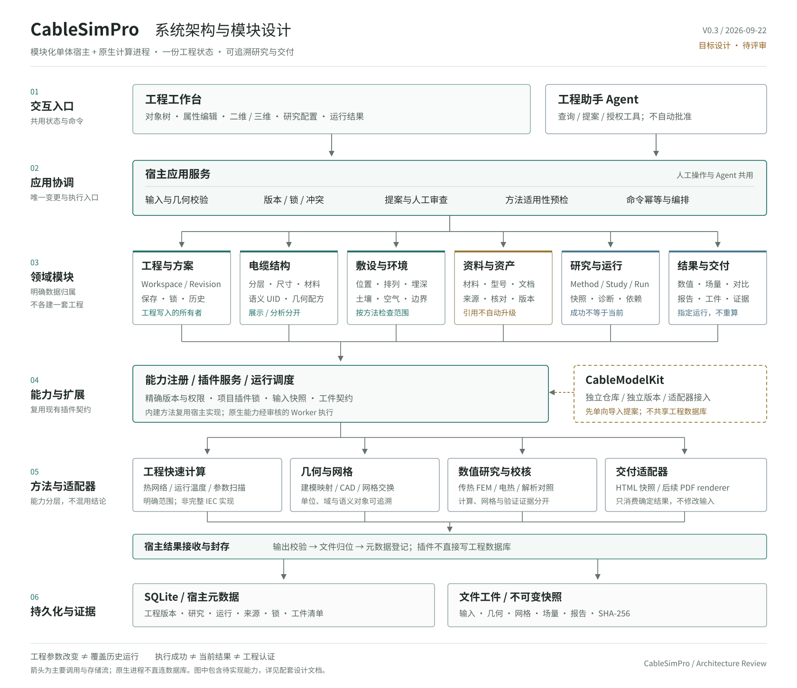

# CableSimPro 系统架构与开发指导

版本：0.5 指导方案草案  
日期：2026-09-26  
变更：0.4 确立“宿主不内置算法”，新增 [插件契约](./PLUGIN_CONTRACT.md)、[领域模型](./DOMAIN_MODEL.md)、[结果类型](./RESULT_TYPES.md) 三份设计。0.5 按方向决策（§7.1）重排开发顺序：先收敛界面、用 IEC 60287 / TB 880 建立可信度，再插件化；插件分发与双模式暂缓。  
用途：作为后续模块设计、接口实现和迁移评审的共同依据。不代表所有功能已经实现，也不授权直接合并分支、迁移数据库或删除历史数据。



[PNG 总图](./system-architecture.png) · [可编辑 SVG](./system-architecture.svg) · [详细设计](./MODULE_DESIGN.md)

[产品需求与分期规划（PRD）](../product/PRD.md) 定义用户目标、功能优先级和产品验收；本文及实施细则定义技术实现约束。两者冲突时评审并同步，不隐式改变工程安全与数据保留边界。

## 1. 产品和仓库边界

**CableSimPro 是工程宿主；CableModelKit 是独立建模产品；Jev 是可替换的候选判断服务。宿主不内置算法，所有计算方法都是插件。**

主流程：定义电缆 → 设置敷设 → 配置研究 → 真实计算 → 复核结果 → 交付。界面、Agent、插件都服务于这条流程，不各自建立一套工程数据。

| 对象 | 承担的职责 | 不承担的职责 |
| --- | --- | --- |
| CableSimPro | 工程、版本、审批、研究、执行协调、结果、资料与交付 | 不把算法和原生库全部写进前端 |
| CableModelKit | 参数化建模、几何与模型工件、已有有限范围扩展 | 不成为宿主工程数据库或绕过宿主批准 |
| 计算方法插件 | 全部计算：热网络、查表法、CAD、网格、FEM、电热或校核；按方法契约声明输入、范围、输出与证据 | 不改写输入，不把局部基准升级为工程认证；宿主中不出现按插件 ID 分支的代码 |
| Jev 等语义服务 | 资料候选选择、意图分类等辅助判断 | 不求解、不决定权限、不批准参数变更 |

近期以本机可信用户为部署范围；插件只有随仓库交付的第一方插件，合作方签名插件属于后续阶段（§7.1）。领域模型第一版即可描述直埋 / 排管 / 多回路、空气 / 隧道 / 竖井 / 桥架、三芯 / 铠装 / 多芯和暂态负荷，但**能描述不等于能计算**：每种工况只有在某个插件声明支持并通过验证后才可计算。多人云端和公共市场仍需独立设计，不能通过增加菜单宣称支持。

## 2. 指导决策

以下作为推荐开发基线。改变时说明受影响的数据、接口、迁移和测试，不默默新建平行实现。

| 决策 | 原因 | 实现约束所在 |
| --- | --- | --- |
| 模块化单体 + 原生 Worker | 保留现有代码与部署方式，隔离重型环境 | 详细设计 §3、§11 |
| Workspace 是唯一当前工程 | 避免界面、Agent、插件持有冲突参数 | §3、§8 |
| 工程、研究、运行、交付分别建模 | 参数可以编辑，历史证据仍须准确 | §4 |
| 接受运行时固定输入 | 完成时工程可能已变化 | §5、§6 |
| 方法输入由宿主准备并验证 | 原始模型不等于分析模型 | §5.5、§9 |
| 插件与资产采用准确版本引用 | 不能静默换版或靠名字猜材料 | §4.2、§11.4 |
| 输入身份与实际环境分别记录 | 输入一致不代表环境或文件字节一致 | §4.3 |
| 工程写入收敛到已有服务 | 保留参数锁、审批和整体校验 | §10.3 |
| AI 是建议层，不是安全边界 | 模型错误不能扩大工程权限 | §13 |
| 宿主不内置算法（方法即插件） | 平台能力靠插件扩展；新增方法不改宿主 | [插件契约](./PLUGIN_CONTRACT.md) |
| 先闭环，再扩展工况 | 先证明一条真实流程，再增加复杂度 | §12 |

“可读取历史”“可重新运行”“数值可复现”“文件字节完全一致”是不同承诺，不能互相替代。

## 3. 模块分工

| 模块 | 所属层 | 一句话职责 | 现有实现基础 |
| --- | --- | --- | --- |
| M01 工程与方案 | 内核 | 当前工程和合法变更 | workbench、sqlite_workspace、共享 Studio 状态 |
| M02 电缆模型 | 领域模型 | 电缆类型、分层、材料引用（[领域模型 §4–5](./DOMAIN_MODEL.md)） | schemas、foundation、模型视图 |
| M03 敷设与环境 | 领域模型 | 回路、敷设截面、负荷工况、设计准则（[领域模型 §6–8](./DOMAIN_MODEL.md)） | 现有 Installation 与工况输入 |
| M04 材料与资产 | 平台服务 | 有来源的定义、型号及准确版本 | R2 资产库、企业型号 |
| M05 资料与依据 | 平台服务 | 原始资料到可核对证据与参数候选 | 文档库、OCR/provider、设计依据 |
| M06 研究与运行 | 内核 | 固定快照、研究驱动器（单次、扫描、选型、比较、多步流程）、运行封存 | runtime、插件任务；新增统一 Study/Run |
| M07 结果与交付 | 平台服务 | 按结果类型读取、比较并交付指定结果（[结果类型](./RESULT_TYPES.md)） | 结果组件、工件接口、快照报告 |
| M08 插件与环境 | 插件宿主 | 插件包、签名、独立环境、项目锁、通用执行器（[插件契约](./PLUGIN_CONTRACT.md)） | 唯一 backend/plugins 与 Plugin Spec |
| M09 工程助手 | 平台服务 | 理解任务、查询和提出变更；工具清单来自插件注册表 | 现有 Agent/runtime；后续可选语义判断 |

这些是代码职责，不是九个微服务、九套首页或九份数据库。读写权和具体接口只维护在 [详细设计 §3](./MODULE_DESIGN.md#3-模块与写入权)。

### 3.1 分层与目录

```text
┌────────────────────────────────────────────────────────────┐
│ 工作台外壳（前端）：单一外壳；参数表单由 schema 生成，结果按类型渲染 │
├────────────────────────────────────────────────────────────┤
│ 平台服务：资产与型号 · 资料与依据 · 结果与交付 · 工程助手           │
├────────────────────────────────────────────────────────────┤
│ 插件宿主：插件包与签名 · 独立环境 · 项目锁 · 预检 · 通用执行器 · 封存 │
├────────────────────────────────────────────────────────────┤
│ 内核：工程 / 版本 · 研究 / 运行 / 工件 · 来源 · 提案审批 · 存储      │
│ 领域模型：材料 · 电缆类型 · 回路 · 敷设截面 · 负荷工况 · 设计准则     │
└────────────────────────────────────────────────────────────┘
        ↑ 插件只读"领域快照"，只写"结果与工件"（跨进程，语言无关）
┌────────────────────────────────────────────────────────────┐
│ 插件包：method · geometry · mesh · import · export · data   │
└────────────────────────────────────────────────────────────┘
```

目标目录（迁移中逐步形成，不一次性搬迁）：

| 目录 | 内容 |
| --- | --- |
| `backend/kernel/` | 工程、版本、研究、运行、工件、来源、提案 |
| `backend/domain/` | 领域模型 schema、校验、快照生成、v0 迁移 |
| `backend/plugin_host/` | 插件包、签名、环境、注册表、预检、执行器、封存 |
| `backend/services/` | 资产、资料、结果与交付、工程助手 |
| `sdk/` | `cablesim-plugin-sdk`：协议、领域类型、单位、命令行工具 |
| `plugins/<plugin-id>/` | 第一方插件，每个插件一个目录 |
| `frontend/` | 单一工作台外壳（`WorkflowApp`）与结果类型渲染器 |

## 4. 数据与执行主线

```text
人工编辑 ───────────────→ 工程服务校验 → 已保存工程版本
AI / 资料 / 建模输入 → 提案 → 人工确认 ────────────┘

已保存工程 + 已保存研究 + 确定方法/插件锁
    → 准入检查与固定快照
    → 事务外真实执行
    → 输出验证与封存
    → 只读结果 / 对比
    → 独立 Delivery（报告引用指定运行）
```

| 需要回答的问题 | 设计材料 |
| --- | --- |
| 当前与历史数据如何区分 | [数据关系图](./data-model.svg) / [详细设计 §4](./MODULE_DESIGN.md#4-数据模型) |
| 运行中修改工程怎么办 | [执行时序图](./execution-flow.svg) / [§6](./MODULE_DESIGN.md#6-执行时序与事务) |
| 哪些结果可以显示为当前 | [§7 状态与异常决策](./MODULE_DESIGN.md#7-结果怎样算当前) |
| 前端哪些状态可编辑 | [§8 前端状态](./MODULE_DESIGN.md#8-前端状态与页面责任) |
| 旧 API、旧数据如何接入 | [§10 兼容迁移](./MODULE_DESIGN.md#10-现有记录怎样接入) |

工作台以模型、研究、结果、对比/交付四类文档组织。资产、资料、插件和助手按需进入，不重建当前工程。

## 5. 计算能力分层

所有计算能力都由插件提供，宿主只按能力声明编排。常见的能力层次：

| 层次 | 插件种类 | 典型用途 | 必须保持的区别 |
| --- | --- | --- | --- |
| 工程快速计算 | method | 热网络、查表法、运行温度、允许电流 | 有明确假设，不是完整 IEC/GB 实现 |
| 几何与网格准备 | geometry、mesh | 几何、域映射、共享拓扑、网格 | 模型能显示、几何有效、网格可用分别检查 |
| 数值研究 | method | 固定功率传热、电热运行点、温限电流、暂态 | 固定功率温度场不能标成载流量 |
| 独立验证 | method（`analysis: crosscheck`） | 解析对照、守恒、网格/域敏感性、外部证据 | 验证只对声明工况、版本和方法有效 |

参数扫描、反向选型、方案比较、交叉校核由宿主的研究驱动器提供（[插件契约 §8](./PLUGIN_CONTRACT.md)），对任何声明了相应输出的方法通用。

新增物理方法至少需要：输入契约、适用范围、单位和坐标、材料/边界要求、失败条件、结果契约、验证夹具、来源关联。方法选择不是“换一个求解器名字”。

研究链按能力声明的输入 / 输出工件类型连接成固定步骤（[插件契约 §4.3](./PLUGIN_CONTRACT.md)），不建设用户任意拖拽和执行脚本的通用工作流引擎。中间工件必须关联同一确定输入或明确的上游运行。

## 6. 外部集成策略

### CableModelKit

本轮已读取开发提交 `a4eb1e869d7a3a78e949da5ac757be22a3c7633a` 的实际契约与导出代码，不能再按“尚无可读接口”设计。Core 导出包含 asset.json、request.json、文件清单、几何域、单位和坐标；准确适配约束见 [§9](./MODULE_DESIGN.md#9-cablemodelkit-与资产接入细则)。

以 `import` 插件接入，分三步：只读检查与展示 → 有限结构的参数提案（映射到[领域模型](./DOMAIN_MODEL.md)的电缆类型） → 单独验证分析几何/网格接入（作为 `geometry` / `mesh` 工件）。Core 工件与拓扑/热研究扩展按各自契约检查，不能把整个仓库统一标记为 FEM-ready。

### Jev

后续候选，默认关闭。接入 M05/M09 的可替换判断接口，不增加必需顶层模块。先做只给建议的样例评估；未配置、超时或低把握时退回人工判断，不阻塞保存、计算和已有报告。完整约束见 [§13](./MODULE_DESIGN.md#13-可选语义判断服务jev)。

### 其他求解器与报告

COMSOL/AEDT 等需许可的软件以 `executable` 插件 + `tools` 声明接入（暂缓，见 §7.1），软件位置和许可由用户配置（[插件契约 §5.1](./PLUGIN_CONTRACT.md)）；其他 FEM 同样作为方法插件；PDF renderer 作为 `export` 插件。许可证、可用环境和方法验证独立处理。已有 HTML 报告继续消费保存的运行输出，不因接口统一而重新求解。

## 7. 开发顺序

### 7.1 方向决策（2026-09-26）

| 决策 | 内容 |
| --- | --- |
| 先跑通，再做平台 | 首要目标是一条可信的工程闭环：单回路直埋稳态载流量，从建模到计算书。首批用户和工况不预设，闭环跑通后再选 |
| 插件化，但不做插件分发 | 代码按“宿主不内置算法”组织，插件在仓库内以第一方形式存在。合作方插件目前只是设想，签名、`.cspkg` 发行包、每插件独立环境、SDK 独立发布、COMSOL 等外部软件接入全部暂缓 |
| 放弃双模式 | 不再维护“专业工作台 + 智能工程流”两个正式模式；前端只保留 `WorkflowApp` 一个外壳，工程助手是工作台内的辅助功能 |
| 可信度以标准为依据 | 热网络按 IEC 60287-1-1 / 2-1（2023，Ed.3.0）拆分计算，用 CIGRE TB 880 参考算例逐项比对中间量和最终量。“与旧代码一致”的黄金值只作重构回归，不作正确性证据 |
| 界面冻结 | D1 之后不再做整体换肤或布局重做，界面改动只服务于闭环所需的具体功能 |

### 7.2 开发顺序

| 顺序 | 开发结果 | 进入下一步之前 |
| --- | --- | --- |
| D0 固定集成基线 | 已完成：main 为唯一主线（含插件电热 / 线源校核链），CI 统一在 main/PR 运行，仓库卫生规则生效 | — |
| D1 界面收敛 | 默认入口改为 `WorkflowApp`；删除 `LegacyEntry`、双模式、旧 Studio / Enterprise 外壳及其 e2e；迁入工程 JSON 导入 / 导出、重做、设计依据；其余旧界面能力按 PRD §4.4.1 暂停 | 卫生遗留清单清空；CI 只测在用界面 |
| D2 可信度基线 | 现有热网络黄金值回归（`tests/test_engine_golden.py`）；IEC 60287 单芯品字形直埋 / 排管方法（`plugins/cablesim.iec60287`，[说明](../plugins/IEC60287_SINGLE_CORE.md)），TB 880 六个算例逐项验证；直埋 FEM、电热、线源校核的黄金值随 D5 插件迁移补齐 | 选定算例的各中间量与最终载流量在登记容差内；不符项明确列出，不调参凑数 |
| D3 热网络插件化 | 仓库内 v2 最小协议：`plugin.json`、`request.json` / `result.json`、通用执行器、结果契约校验；热网络迁出为第一个插件 | 宿主中不再有 `engine.py`；结果与 D2 基准一致 |
| D4 首条闭环 | 统一 Study / Run、固定快照执行、工程版本档案、只读运行视图、历史比较、HTML 计算书 | PRD J1、J2、J6 走通；报告输入与图表同源、导出不重算 |
| D5 领域模型与其余插件 | `cablesim.domain/1`、v0 工程迁移；迁移其余 worker 插件；结果类型渲染器替换前端特判；新工况按需接入（优先多回路、排管） | 旧工程可转换且原数据不变；宿主无按插件 ID 的分支 |
| D6 研究驱动器 | 参数扫描、反向选型、方案比较、交叉校核驱动器 | 每个采样点 / 候选独立成败，不外推 |

**暂缓**（需要时单独立项，不作为以上各步的前置条件）：插件签名与分发、合作方 SDK、每插件独立环境、COMSOL / 外部软件、工程助手独立模式、Jev、持久化队列与通用取消、多用户与公共市场。

**标准资料边界**：标准正文和 TB 880 位于仓库外的受控目录，按其目录说明只可作受控 staging 与验证。本仓库是公开仓库，正文、截图和逐值抽取的算例数据都不提交；验证夹具从仓库外路径读取，路径缺失时相关测试明确跳过并报告，不以替代数据冒充通过。

完整验收与发布约束见 [详细设计 §12](./MODULE_DESIGN.md#12-迁移顺序与验收)。普通变更沿用 PR/测试记录，不为小改强制新建架构报告。

## 8. 设计变更条件

- 改变模块所有权、持久化语义、单位/坐标、方法假设、版本兼容或审批边界时，同步修改对应契约和直接相关验证。
- 新功能若需要第二份可编辑工程、静默换方法/版本或绕过批准，应先修正设计。
- 多人协作、服务器托管、远程 Worker 需要重新设计身份、并发、存储和调度，不能把本机预览直接暴露公网。
- 本机 SQLite 数据目录不作为多人共享文件数据库；部署边界见详细设计 §11.3。
- 方法可以扩展，但固定输入、显式来源、明确范围、不可变结果继续保留。

## 9. 依据与未完成项

| 固定参考 | 用途 | 证据边界 |
| --- | --- | --- |
| CableSimPro `a047f84` | 工作流、状态、运行、R2 与插件源码 | 已读相关源码；本轮未重新运行应用 |
| CableSimPro `c699992` | 直埋插件工作区底座 | 既有候选基线，不视为 main 已合并 |
| CableSimPro `e558115` / `c319a57` | 电热和独立解析校核 | 分别评审，不自动拼成完整产品能力 |
| CableModelKit `a4eb1e8` | Core schema/exporter、准备/热研究扩展 | 已读接口；未执行导出、网格或求解 |
| TypeSafe Jev 官方文档 | 候选服务能力与限制 | 未配置 Key、未调用付费服务、未验证中文电缆任务 |
| SQLite 官方 WAL 文档 | 本机部署与并发边界 | 不代替项目环境和恢复测试 |

仍需在对应阶段完成：集成分支选择、CableModelKit 真实样例核验、外部工程证据、备份恢复演练和原生环境回归。它们是实施事项，不影响当前职责与数据契约设计。

主要原文：
- [CableSimPro 工作流说明](https://github.com/luohui1/CableSimPro/blob/a047f84e225a75e784f26a03b932147f066c9825/docs/integration/ENGINEERING_WORKFLOW.md)
- [R2 契约源码](https://github.com/luohui1/CableSimPro/blob/a047f84e225a75e784f26a03b932147f066c9825/backend/foundation/contracts.py)
- [既有声明式预检包](https://github.com/luohui1/CableSimPro/blob/a047f84e225a75e784f26a03b932147f066c9825/backend/foundation/study.py)
- [Plugin Spec](https://github.com/luohui1/CableSimPro/blob/a047f84e225a75e784f26a03b932147f066c9825/plugin-spec/README.md)
- [CableModelKit schema](https://github.com/luohui1/CableModelKit/blob/a4eb1e869d7a3a78e949da5ac757be22a3c7633a/src/cable_modelkit/schema.py)
- [CableModelKit exporter](https://github.com/luohui1/CableModelKit/blob/a4eb1e869d7a3a78e949da5ac757be22a3c7633a/src/cable_modelkit/exporters.py)
- [SQLite WAL](https://sqlite.org/wal.html)
