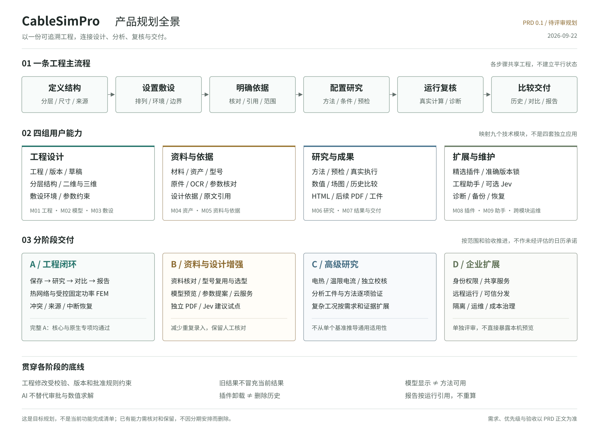

# CableSimPro 产品需求文档

文档版本：0.1  
日期：2026-09-22  
状态：完整规划草案，待产品范围与发布基线评审  
定位：定义用户价值、功能范围、交互行为、优先级与验收条件；不是已上线功能清单。



[产品全景 PNG](./product-map.png) · [架构总纲](../design/SYSTEM_ARCHITECTURE.md) · [技术实施细则](../design/MODULE_DESIGN.md)

## 阅读导航

- 了解产品：§1-4，定位、用户、目标和分期范围。
- 设计界面与流程：§5-6、§10，信息架构、场景与状态。
- 拆分研发需求：§7-9、§14，需求编号、方法边界、数据与里程碑。
- 制定测试：§11-13、§15，质量目标、信任边界、发布门槛与跨模块验收。
- 确认取舍：§16-18，依赖、待确认事项和变更规则。

## 1. 产品定义

### 1.1 一句话定位

**CableSimPro 是以工程项目为中心的电缆设计与分析工作台，让工程师在同一份可追溯数据上完成结构定义、敷设配置、研究计算、结果复核和报告交付。**

产品主线：

```text
打开工程 → 明确结构与参数来源 → 设置敷设
    → 选择适用的研究方法 → 真实计算
    → 查看/比较结果 → 导出可追溯交付物
```

不是聊天工具附带一个计算按钮，也不是将所有科学计算库放进一个导航菜单。AI 和插件帮助完成上述流程，不拥有独立的工程真值。

**平台原则：宿主不内置算法。** 宿主只负责工程、版本、研究/运行快照、来源、工件、报告与审批；热网络、查表法、IEC 方法、FEM、电热与校核等所有计算方法都以插件接入，通过统一的方法契约声明输入、适用范围、输出与验证证据。新增方法应只涉及插件本身，不修改宿主。

### 1.2 仓库与产品边界

| 对象 | 产品职责 | 接入定位 |
| --- | --- | --- |
| CableSimPro / `luohui1/CableSimPro` | 主工作台、项目、研究、载流量、资料、插件协调、结果与交付 | 主体产品 |
| CableModelKit / `luohui1/CableModelKit` | 独立参数化建模及模型工件 | 保持独立，通过检查、映射和批准进入宿主 |
| 计算方法插件 | 全部计算方法：热网络、查表法、几何、网格、传热、电热或校核 | 平台的计算能力来源；核心方法随包提供，原生方法可选安装；安装不等于可执行或已验证 |
| Jev 等判断服务 | 资料候选筛选、意图分类等辅助工作 | 后续候选，默认关闭、可替换 |
| 云端 OCR / 通用模型 | 资料识别、任务理解与解释 | 用户配置并同意外发后使用，不是计算必需条件 |

### 1.3 本文依据

以本次会话已检查的固定源码和架构 V0.3 为基线。主要参考 CableSimPro `a047f84`、插件底座 `c699992`、独立电热/校核分支，以及 CableModelKit `a4eb1e8`。具体来源见架构文档。

这些分支的功能不能简单相加后标成“现产品全部支持”。本 PRD 未重新运行应用、CI 或原生求解，所有功能需求默认是**待评审目标**，不是验收完成状态。

现有能力被安排到后续阶段，指统一、补齐或扩大支持范围的时间，不表示删除现有功能。实施前应固定实际分支并列出保留、迁移、只读兼容及新增项。

## 2. 用户与问题假设

本节为基于项目上下文的产品假设，尚未经过正式用户访谈。首批试用应验证这些假设，不编造客户规模、使用率或节省时间。

### 2.1 用户角色

| 角色 | 核心任务 | 需要得到的结果 |
| --- | --- | --- |
| 电缆设计/选型工程师，主用户 | 定义结构、配置工况、调整方案、评估候选 | 可解释的参数、结果和差异 |
| 研发/仿真工程师 | 配置分析方法、检查网格/边界、比较方法与验证 | 可复核的原始工件、诊断和证据 |
| 技术资料维护人员 | 整理厂家资料、材料、型号及版本 | 不丢来源且可复用的资料库 |
| 技术复核人员 | 核对输入、适用范围、计算与报告 | 明确来源的输入与结果，不混入当前草稿 |
| 本机维护者 | 安装、备份、恢复和处理原生环境 | 数据安全与可诊断运行状态 |
| 报告接收者 | 阅读交付物，了解条件和限制 | 不依赖当前工作区也能理解的报告 |

阶段 A-C 中这些是工作职责，同一人可以兼任；不是已经实现的多人账户/RBAC。企业权限属于阶段 D。

### 2.2 待解决的问题

1. 参数、资料、图形与结果分散，难以确认“这次计算究竟用了什么”。
2. 修改输入后，旧数字或旧场图容易被误当成当前结果。
3. 复杂结构“能显示”容易与“能计算、经过验证”混淆。
4. 厂家资料中的型号、单位与字段需要人工核对，自动提取可能串行或误选。
5. 热网络、FEM 和独立校核的输入、输出与适用范围不同，缺少一致的操作流程。
6. 交付报告时容易混用新参数、旧图或不同版本结果。
7. 原生计算失败、环境缺失或服务中断时，用户缺少明确的恢复路径。

## 3. 产品目标与成功判断

### 3.1 目标

| 目标 | 用户可感知的变化 | 衡量方式 |
| --- | --- | --- |
| G1 完成真实工程闭环 | 不切换多套工具即可得到来源明确的研究与报告 | §15 的完整流程验收；试用任务完成率 |
| G2 避免版本混用 | 用户始终知道结果对应哪个输入 | 来源一致性检查；旧结果误显示用例 |
| G3 降低重复录入 | 资料、型号与结构能经核对复用 | 导入后人工修正次数、复核耗时 |
| G4 明确工程可信边界 | 不适用的模型被阻止，限制随结果交付 | 方法范围、缺参、无解、验证边界测试 |
| G5 可恢复、可维护 | 出错时不丢已保存数据、不重复求解 | 故障注入与备份恢复演练 |

### 3.2 首批衡量规则

- 正确性发布门槛：指定验收集内，输入/结果/报告来源不一致、越权应用提案、静默覆盖冲突、同请求重复执行均应为零。
- 可追溯性：阶段 A 新受管理运行的必需来源字段与报告引用完整率目标为 100%；旧数据缺口显式显示，不通过补猜“达标”。
- 效率：记录首次有效报告耗时、调整并复算耗时、资料复核耗时；先建立当前流程基线，再确定改善目标。
- AI 效果：衡量错型号/错行/错单位、需人工处理比例与复核成本，不仅看总准确率。
- 性能：按 §11 的固定测试条件测量；文档内目标不是已测成绩。

本机记录默认不向外部发送遥测。跨用户数据分析需另行获得同意并最小化采集。

## 4. 范围与产品路线

### 4.1 分期定义

阶段名称仅用于产品规划，不等于代码分支名、架构 R2 或已发布版本。

| 阶段 | 用户价值 | 必须交付 | 不作为本阶段承诺 |
| --- | --- | --- | --- |
| A 工程闭环 | 完成并保留一次可信来源的工程研究 | 单工程、结构/敷设、明确来源输入、热网络、统一研究/运行、历史比较、HTML 交付；固定功率 FEM 在已准备环境中完成受控接入 | 多用户、任意几何求解、完整标准认证、原生 PDF |
| B 资料与设计增强 | 减少录入，复用资料和型号 | 资料核对、资产/型号版本、反向选型、既有专项场/竖向方法的统一入口、CableModelKit 只读与受支持提案、可选云端服务 | 任意 CAD 直接 FEM、无条件自动选型、公共市场 |
| C 高级研究 | 深入比较和验证物理模型 | 电热反馈/温限电流、独立校核、分析工件接入、方法级数值验证；按实际需求增加复杂工况 | 将单个基准结果推广成通用认证 |
| D 企业扩展 | 多人治理和更大规模运行 | 经单独立项确认的身份权限、共享服务、远程执行及分发治理 | 直接将本机数据目录共享或把预览服务暴露公网 |

阶段 A 的普通用户不需要安装 CAD/FEM 环境或配置云端 Key 才能保存、进行内建研究和读取报告。阶段 A 的插件接入验收则需在明确的原生环境上执行真实专项验证，两者分别验收。

阶段 A 设置两个发布门槛：**A-core 核心闭环**与 **A-native 原生专项**。完整阶段 A 要求两者均通过；可先交付范围明确的 A-core 预览，但不得标记阶段 A 全部完成，未验收原生能力不作为该预览的可用能力开放。它们是发布范围和测试门槛，不是两套长期产品或前端。

“用户未安装原生环境”是正常运行状态；“发布方尚未验证声明支持的原生环境”是发布缺项，不能混为一谈。

### 4.2 优先级规则

- **P0**：所属阶段不可缺少；缺失会破坏主流程、数据安全或结果解释。
- **P1**：所属阶段的重要效率/体验能力；可以明确限缩，但不可伪装完成。
- **P2**：探索或条件成立后启动，需单独评估。

“B/P0”表示阶段 B 的必需项，不表示全部在阶段 A 实现。本文优先级是建议基线，冻结发布范围时确认。

### 4.3 阶段 A 明确边界

计算主线为现有单回路、三根相同无铠装单芯电缆的受限模型。二维/三维展示不自动扩大此范围。

不承诺：完整 IEC/GB 条款实现、排管/多回路/干燥带/暂态通用求解、通用 CAD/CAE 替代、企业认证签审、无人批准的自动设计、第三方任意代码安装。

现有其他能力可以保留在标明范围的兼容入口，不能在新默认流程中被误称为完成统一验证。

### 4.4 既有能力保留与迁移

本清单适用于 A0 选定基线中实际存在的能力；其他未合入分支不自动成为“必须全部保留”的已发布功能。A0 应核对并补充实际入口，不凭本文标成已通过。

| 既有能力 | 阶段 A 的用户路径 | 后续安排 | 回归/退出条件 |
| --- | --- | --- | --- |
| 基本结构、敷设、载流量 | 迁入默认模型/研究工作区，保留数据与方法范围 | 继续在同一工作区扩展 | T-01、T-05、T-06 通过后才替换原操作路径 |
| 扫描与历史计算 | 提供明确来源的访问；未统一部分标明兼容用途 | 逐步统一为研究和运行视图 | 扫描点/旧运行未丢失；T-19 核验 |
| 旧工程 JSON / ProjectStore | 保留原数据，显式打开/导入；不支持格式给出转换缺口 | 转成独立受管理 Workspace | 不按名字自动合并；失败不改原件；T-19 |
| 资料、型号、资产及既有 OCR | 已有受支持流程可从兼容入口访问，来源/同意规则保留 | B 完成统一页与完整提案流程 | T-13、T-14 与既有直接回归 |
| 已有空气/竖向、电场/磁场 | 按原有限范围保留可用路径，不宣称新工作流已验收 | B 统一方法与结果入口 | 原方法回归及 F-ENV-03、F-RES-05 验收 |
| 旧 HTML 报告和已导出文件 | 保留读取；新工作流使用指定运行报告 | B 增加独立 PDF renderer | T-10；不能用重算报告替代旧快照 |
| 已有插件/原生研究 | 按准确基线、环境和方法状态展示 | A-native/B/C 分别完成对应接入 | 不把其他分支的能力直接加进“已支持” |

技术路由迁移以 [实施细则 §10.3](../design/MODULE_DESIGN.md#103-旧入口迁移矩阵) 为唯一映射依据，PRD 不重复定义端点实现。某旧路径无法安全操作新数据时，不得默默删入口或自动写入；明确只读/转换/替代路径并评审发布范围。移除入口前需要可用替代、数据保留和对应回归，不以“安排到下一期”作为删除理由。

## 5. 信息架构与产品界面

### 5.1 一级结构

```text
工程入口：最近工程 / 新建 / 打开 / 导入
    └─ 工程工作区
        ├─ 模型文档：电缆结构、二维/三维、敷设
        ├─ 研究文档：方法、条件、预检、发起
        ├─ 结果文档：运行结果、输入、诊断、工件
        └─ 对比与交付：指定运行集合、报告

按需进入：材料/型号/资产、资料库、设计依据、插件中心
按需打开：工程助手、诊断、显示/服务设置
```

### 5.2 工作区布局原则

顶栏显示工程与保存状态、当前版本和主要操作；左侧是工程对象与研究树；中间是当前文档；右侧检查器随对象变化。结果不永久遮住模型，助手不是必须占据的常驻聊天墙。

用户打开“绝缘层”应看到真实绝缘字段；打开“结果”应看到该运行的只读输入和输出，不能只换标题而保留同一组当前编辑字段。

首屏不做营销页或组件展示台。插件不逐个增加一级导航。已有视图姿态和共享草稿在文档切换时保留。

### 5.3 操作可发现性

主要操作使用明确名称；低频操作进入菜单或命令搜索。图标控件有可读名称、焦点和提示。保存工程、保存研究、运行研究、导出结果分别表达，不能用一个含糊按钮隐藏多个副作用。

桌面是完整编辑的主要目标；紧凑屏幕先保障浏览、复核和非复杂输入，不承诺手机完整 CAD/FEM 操作。

## 6. 关键用户场景

### J1 从零完成一个直埋研究

新建工程 → 选择明确标注的模板或录入结构 → 核对 R20 等必需输入与来源 → 配置敷设 → 保存 → 选择热网络研究 → 查看范围和预检 → 运行 → 复核三相结果与警告 → 导出 HTML 报告。

缺少必要输入时停在具体字段；模板值必须带演示标记。成功不等于满足温限，超温必须显著显示。

### J2 改参数并比较前后结果

打开运行 R-A → 编辑绝缘厚度形成草稿 → 保存新版本 → 新建运行 R-B → 选择 R-A/R-B → 先看参数与方法差异，再看可比指标 → 导出较早运行。

旧结果保留，不被覆盖；草稿不是分析输入。撤销参数不会倒退版本号或自动复活旧审批。

### J3 从厂家资料形成工程参数

导入原件 → 查看文字层或明确发起 OCR → 选择单一型号及页/片段 → 提取候选 → 逐项核对值、单位、型号和来源 → 生成变更提案 → 批准后保存新版本。

来源歧义必须显式处理。AI 建议不是人工核对状态，也不是厂家真实性认证。

### J4 按目标电流筛选型号

确定工况和目标 → 选择已核对型号范围 → 按每个候选完整输入复算 → 查看淘汰原因与来源 → 对比候选 → 确认提案后应用。

不按截面积比例猜载流量；缺价格不能声称成本最优。适用范围之外的候选不进入“合格”列表。

### J5 使用建模或数值插件

查看能力/环境状态 → 审查依赖与许可/权限 → 项目启用准确版本 → 选择研究或导入模型 → 预检 → 明确执行 → 查看真实输出和限制。

安装登记、环境存在、实际执行成功和工程验证分别展示。模型显示正常不表示其可供当前方法求解。

### J6 中断后继续工作

服务恢复 → 打开已保存工程 → 查看运行是否可确认完成 → 对异常运行显示来源、诊断与恢复限制 → 用户明确重试或保留历史 → 必要时从一致性备份恢复。

不自动重复计算，不将断网当作取消；无法确认状态时不给成功结果。

## 7. 功能需求

本节所有需求初始状态均为“待评审”。编号保持稳定，取消需求保留其编号与原因，不将已使用编号赋给另一功能。每项“验收要点”是用户可观察的目标，不是本轮已经执行的测试。

### 7.1 工作台与导航

映射：跨模块 UI 外壳，复用 M01/M06/M07 状态。

| ID | 需求 | 阶段/优先 | 验收要点 |
| --- | --- | --- | --- |
| F-WB-01 | 最近工程、新建、打开入口 | A/P0 | 能从入口进入真实工程；空列表提供可执行新建操作，不创建假数据 |
| F-WB-02 | 对象树、文档和检查器联动 | A/P0 | 选择不同层/敷设/研究显示对应真实字段；结果文档只读 |
| F-WB-03 | 切换文档保留工作上下文 | A/P0 | 草稿、当前选择与模型视图保留；切换不隐式保存或计算 |
| F-WB-04 | 命令搜索与按需资源页 | A/P1 | 能找到已有操作；打开/返回资源页不丢工程，不重复挂载新项目 |
| F-WB-05 | 紧凑布局和可访问性 | A/P0 | 目标尺寸无关键按钮被遮挡；键盘能完成主要表单、对话框和错误定位 |

### 7.2 工程与版本

映射：M01。

| ID | 需求 | 阶段/优先 | 验收要点 |
| --- | --- | --- | --- |
| F-PRJ-01 | 创建、命名、保存、重开工程 | A/P0 | 保存后重启仍可打开相同工程；演示模板与用户数据明确区分 |
| F-PRJ-02 | 草稿与整体保存校验 | A/P0 | 空值、非法值、几何冲突定位到字段；失败不丢草稿、不部分保存 |
| F-PRJ-03 | 参数锁与多窗口冲突 | A/P0 | 锁定字段不能被编辑/提案绕过；旧版本保存明确失败且不覆盖新版本 |
| F-PRJ-04 | 撤销、重做与永久档案区分 | A/P0 | 撤销后再编辑不抹掉已保存运行的来源；版本号不倒退 |
| F-PRJ-05 | 输入导入、导出及兼容检查 | A/P0 | 无效输入不替换当前工程；明确输入 JSON 不包含完整文档/历史/工件 |
| F-PRJ-06 | 归档与另存独立工程 | B/P1 | 归档不物理删除历史；另存产生独立身份，不共享可编辑状态或冒充原运行 |

阶段 A 不实现含义模糊的“删除一切”按钮；涉及清理按 F-OPS-03 处理。现有旧项目数据通过显式导入进入受管理工作区，不自动按名称合并。

### 7.3 电缆结构与模型

映射：M02。

| ID | 需求 | 阶段/优先 | 验收要点 |
| --- | --- | --- | --- |
| F-MOD-01 | 受支持电缆分层与尺寸编辑 | A/P0 | 各层、半径/厚度和外径关系一致；范围由契约和方法提供 |
| F-MOD-02 | 二维截面、三维结构联动 | A/P0 | 都对应同一份明确输入；轴向展示长度不冒充线路长度 |
| F-MOD-03 | 剖切、展开、隐藏与视图复位 | A/P1 | 只改展示，不改求解输入；恢复视图不触发计算 |
| F-MOD-04 | 几何/材料来源与简化可见 | A/P0 | 演示值、用户值、外部来源和分析简化可检查，不能由颜色推断材料 |
| F-MOD-05 | CableModelKit 工件检查与只读预览 | B/P0 | 核对文件、单位/坐标及限制；缺失或篡改阻止使用，不因预览成功标为可分析 |
| F-MOD-06 | 受支持模型映射为参数提案 | B/P0 | 展示映射、信息损失和不支持项；批准前不改变工程，额外层不静默丢弃 |

### 7.4 敷设与环境

映射：M03。

| ID | 需求 | 阶段/优先 | 验收要点 |
| --- | --- | --- | --- |
| F-ENV-01 | 现有直埋排列、埋深、间距和环境输入 | A/P0 | 图形与数值使用一致坐标/单位；不把净距与中心距混用 |
| F-ENV-02 | 几何约束和方法适用性校验 | A/P0 | 重叠、越界、过浅或环境不适用有明确原因，不静默修正 |
| F-ENV-03 | 既有有限范围空气/竖向方法统一入口 | B/P1 | 独立显示边界与输入，不能套直埋参数或宣称井道 CFD |
| F-ENV-04 | 多回路、排管、回填等新工况 | C/P2 | 逐工况具备模型、方法、输入和验证后才启用；不是只增加下拉选项 |

### 7.5 材料、资产与型号

映射：M04。

| ID | 需求 | 阶段/优先 | 验收要点 |
| --- | --- | --- | --- |
| F-AST-01 | 来源明确的材料/结构资产目录 | B/P0 | 可搜索并查看单位、来源、版本、适用范围和核对状态 |
| F-AST-02 | 草稿、核对、发布、弃用生命周期 | B/P0 | 修改形成新版本；导入的自述“已核对”不能自动提升可信状态 |
| F-AST-03 | 项目引用准确版本及显式升级 | B/P0 | 库更新不改变旧工程；升级前显示差异并形成工程变更 |
| F-AST-04 | 型号筛选与真实候选复算 | B/P0 | 默认区分演示/已核对型号；逐候选真实计算并保留淘汰原因 |
| F-AST-05 | 候选比较与应用 | B/P1 | 来源、工况、约束和价格条件可比；应用需确认且不能覆盖新工程版本 |

### 7.6 资料与参数依据

映射：M05。

| ID | 需求 | 阶段/优先 | 验收要点 |
| --- | --- | --- | --- |
| F-DOC-01 | 原件导入与页级查看 | B/P0 | 支持发布范围内格式；保存原件身份，拒绝损坏/超限输入且不影响已有资料 |
| F-DOC-02 | 文字层优先、可选 OCR | B/P1 | 原文、OCR 文本分开；调用云端前确认外发，失败不伪造识别内容 |
| F-DOC-03 | 单型号参数候选与人工核对 | B/P0 | 值、单位、字段、型号、页/片段同屏核对；歧义不自动猜测 |
| F-DOC-04 | 来源绑定及工程变更提案 | B/P0 | 每个采用参数可追溯到准确资料版本；批准后才写工程 |
| F-DOC-05 | 文本检索与有引用的辅助问答 | B/P1 | 能打开原文验证引用；没有证据时明确不足，不冒充完整语义知识库 |

资料上传、识别、人工核对和应用是不同动作。默认不将全部原件自动发送给云端模型。

### 7.7 设计依据与标准范围

映射：M05/M06。

| ID | 需求 | 阶段/优先 | 验收要点 |
| --- | --- | --- | --- |
| F-STD-01 | 工程设计依据与适用范围确认 | A/P0 | 依据随工程版本保留；不适用方法被阻止或按明确规则警示 |
| F-STD-02 | 标准目录、引用与实现覆盖分离 | B/P0 | 题录/范围参考不显示成完整算法支持；版本与证据状态可见 |
| F-STD-03 | 新标准方法与参考算例接入 | C/P2 | 取得可用依据、实现和独立验证后再声明支持范围；不因勾选标准改变能力 |

### 7.8 研究与执行

映射：M06/M08。

| ID | 需求 | 阶段/优先 | 验收要点 |
| --- | --- | --- | --- |
| F-STU-01 | 方法目录与已保存研究配置 | A/P0 | 每个研究有明确方法和配置版本；切换方法不继承不兼容参数 |
| F-STU-02 | 只读预检和就绪状态 | A/P0 | 展示缺参、范围、来源及环境问题；预检不创建运行或改变工程 |
| F-STU-03 | 固定输入发起及重复请求保护 | A/P0 | 未保存/过期输入拒绝发起；同一请求重试只关联一次执行 |
| F-STU-04 | 热网络运行与结果解释 | A/P0 | 明确区分允许电流、运行温度和超温；无稳定运行解不伪造温度或损耗 |
| F-STU-05 | 四类已有敷设参数扫描 | A/P1 | 各采样点输入/失败原因可查；不把缺失点补成成功值，不修改当前参数 |
| F-STU-06 | 固定功率直埋 FEM 受控接入 | A/P0 | 在已准备环境中运行真实求解并输出一致场/工件；普通用户缺环境不影响内建功能 |
| F-STU-07 | 电热、温限电流及独立校核统一研究 | C/P0 | 运行点、反求电流、校核分别说明范围和来源；无夹根/不收敛明确失败 |

阶段 A 以同步请求方式完成首条闭环，不承诺可靠后台队列或通用取消；后续增强必须通过中断与恢复验收。

### 7.9 结果与比较

映射：M07。

| ID | 需求 | 阶段/优先 | 验收要点 |
| --- | --- | --- | --- |
| F-RES-01 | 数值、曲线、三相明细及方法诊断 | A/P0 | 单位和物理量清楚；按输出项标明不可用，不用零代替缺失 |
| F-RES-02 | 当前、历史、未知来源与草稿区分 | A/P0 | 改参数不将旧图数字标为当前；能明确打开历史输入 |
| F-RES-03 | 指定运行比较 | A/P0 | 先显示输入、方法、工况差异；不按不同网格的数组下标直接相减 |
| F-RES-04 | 场图与原始工件联动 | A/P0 | 场图对应准确文件；等比例坐标和真实单位；缺失/损坏不显示伪结果 |
| F-RES-05 | 既有电场/磁场等专项结果统一展示 | B/P1 | 展示具体方法与限制，不将解析图标为全耦合 FEM |

### 7.10 报告与交付

映射：M07。

| ID | 需求 | 阶段/优先 | 验收要点 |
| --- | --- | --- | --- |
| F-DEL-01 | 从指定运行生成 HTML 计算书 | A/P0 | 导出不重算；输入、图表、方法和结果来自同一明确来源集合 |
| F-DEL-02 | 报告必需内容与限制说明 | A/P0 | 包含工程标识、源版本、研究/方法、关键输入及来源、结果单位、警告和生成时间 |
| F-DEL-03 | CSV 和原始工件下载 | A/P1 | 实际文件内容与所选运行一致；不能跨工程误取，文本安全处理不改变数值 |
| F-DEL-04 | PDF renderer 与正式版式 | B/P1 | 原生 PDF 单独验收字体、表格、分页和图形；HTML 打印不冒充该能力完成 |
| F-DEL-05 | 完整交付包 | C/P1 | 清单说明所含输入、报告、资料/工件及摘要；缺失与外部依赖可见，不混同可编辑工程备份 |

### 7.11 插件和运行环境

映射：M08，CableModelKit 同时连接 M02。

| ID | 需求 | 阶段/优先 | 验收要点 |
| --- | --- | --- | --- |
| F-PLG-01 | 能力目录及状态区分 | A/P0 | core、可登记适配器和规划条目清楚；未实现条目不提供可用假象 |
| F-PLG-02 | 依赖、权限、许可计划审查 | A/P0 | 执行安装/启用前可看准确计划；不隐式 pip 安装或执行下载代码 |
| F-PLG-03 | 项目启停和准确版本锁 | A/P0 | 不自动换版；操作不改电缆参数；锁变更影响后续发起 |
| F-PLG-04 | 原生环境诊断 | A/P0 | 区分缺依赖、无法加载、执行失败；环境缺失不阻止读历史结果 |
| F-PLG-05 | 建模 bundle 检查、预览与提案接入 | B/P0 | B 阶段仅涵盖原件检查、只读显示和受支持参数提案；不承诺分析网格可直接求解 |
| F-PLG-06 | 安全公共分发/第三方市场 | D/P2 | 身份、签名/撤回、许可、隔离、资源与兼容治理单独通过后才开放 |
| F-PLG-07 | CableModelKit 分析工件资格与方法接入 | C/P0 | 独立验证拓扑、网格、材料、边界和坐标/单位，再交给声明兼容的方法；不复用 B 的预览通过作为求解资格 |

### 7.12 工程助手与 Jev

映射：M09、M05，复用宿主服务。

| ID | 需求 | 阶段/优先 | 验收要点 |
| --- | --- | --- | --- |
| F-AI-01 | 查询工程、结果和有限工程命令 | A/P1 | 明确显示实际能力；只读查询、生成提案和已确认研究按下文分类；任意脚本/路径/进程请求明确拒绝 |
| F-AI-02 | 可审查的参数变更提案 | A/P0 | 差异、完整候选、来源、假设可看；拒绝不改参数，过期/重复批准被拒绝 |
| F-AI-03 | 可选云端模型接入 | B/P1 | 服务端保存密钥，外发需同意；无 Key 或服务失败不影响核心闭环 |
| F-AI-04 | Jev 候选筛选/意图判断试点 | B/P2 | 默认关闭、仅建议；记录规则/模型版本，用脱敏数据比较错选与复核成本 |
| F-AI-05 | 基于确切结果和引用的解释 | B/P1 | 明确引用所选运行/原文；无解或证据不足不生成肯定工程结论 |

AI 输出不能成为自动审批、工程认证或输入范围放宽的依据。Jev 不作为 A 阶段或 B 阶段核心需求的前置条件。

“有限工程命令”只有三类：读取当前授权工程/指定运行；生成宿主可审查提案；按既有确认流程发起准确版本和方法的研究。模型意图判断不代替批准或范围确认。不向助手提供任意 shell、文件路径写入、进程控制、安装或任意 URL 请求工具；资料导入由用户选择后走宿主接口。拒绝请求也应有可诊断原因，不将“本地”理解成可执行系统命令。

### 7.13 运维与数据保护

映射：跨 M01/M06/M08。

| ID | 需求 | 阶段/优先 | 验收要点 |
| --- | --- | --- | --- |
| F-OPS-01 | 本机启动、健康与版本信息 | A/P0 | 能确认宿主/方法与数据版本；不将旧 UI 版本号当全部组件版本 |
| F-OPS-02 | 一致性备份、恢复和迁移保护 | A/P0 | 包含数据库和必要文件；从副本成功演练恢复；旧程序不能写不支持的新库 |
| F-OPS-03 | 归档、卸载与数据清理分离 | A/P0 | 插件停用不删历史；清理前明确影响和引用，未确认不物理删除 |
| F-OPS-04 | 多用户身份与职责权限 | D/P0 | 企业阶段独立设计与验证；当前本机核对标记不冒充身份认证 |
| F-OPS-05 | 重启恢复和可追踪诊断 | A/P0 | 未确认完成的任务不标成功、不自动重算；残留进程/工件状态可解释 |

## 8. 方法与工程能力覆盖

本表是产品范围规划，不是对当前全部分支的合并完成声明。

| 方法/能力 | 面向用户的问题 | 首次统一目标 | 发布时必须说明 |
| --- | --- | --- | --- |
| 直埋热网络 | 当前条件下的模型允许电流和运行温度 | A | 几何/环境范围、损耗系数假设、输入来源与非完整标准边界 |
| 固定功率直埋 FEM | 给定热源下的温度分布与域敏感性 | A，原生能力可选安装 | 有限土壤域、网格与边界，不是允许电流反求 |
| 敷设参数扫描 | 改变某个条件对结果的影响 | A | 每个采样点、输入范围和失败点 |
| 空气/竖向及电磁专项 | 声明条件下的专项研究 | B | 各自有限模型，不能混为井道 CFD 或完整电磁热耦合 |
| 电热运行点/温限电流 | 电流、损耗和温度反馈 | C | R20/材料来源、反馈和求根证据、有限域限制 |
| 独立解析校核 | 不同方法结果是否一致、差异来自哪里 | C | 来源固定、模型近似差别，不等于实验认证 |
| CableModelKit 分析工件 | 更丰富结构如何进入声明兼容的方法 | C | 单位/坐标、共享拓扑、域映射、材料和边界资格 |
| 新复杂工况或标准完整实现 | 扩大真实工程范围 | 按独立立项进入 C/D | 所需模型、授权依据、参考数据、方法与外部验证 |

任何条目只有在输入、算法、输出、用户界面和验证均达到其声明范围后才显示为可运行。未实现、环境缺失、输入不适用和验证不足应分别表达。

## 9. 数据与业务规则

技术数据结构、摘要、事务和旧接口迁移只维护在 [模块实施细则](../design/MODULE_DESIGN.md)，本节定义用户语义。

### 9.1 对象语义

| 用户对象 | 业务规则 |
| --- | --- |
| 工程 | 当前可编辑设计；不是“最近一次结果”的别名 |
| 工程版本 | 已保存状态；与可撤销历史游标不同 |
| 研究 | 方法和配置的定义，可以形成新版本 |
| 运行 | 固定输入的一次执行；后续编辑不覆盖它 |
| 结果工件 | 该次计算的真实输出；损坏不通过重算偷偷替换 |
| 交付 | 指定运行的独立报告/输出记录 |
| 资产/型号 | 可引用的准确版本，库升级不自动改工程 |
| 资料与来源 | 原文身份、版本、位置和核对信息，不能只剩一个文件名 |
| 提案 | 待确认的工程修改，不等于已经应用 |

### 9.2 输入质量

值的来源类型与核对状态分别记录：演示/用户录入/外部资料等属于来源；待核对/已人工核对等属于状态。人工核对不等于独立认证。

空值、零值和不可用结果不同。字段单位显式，合法范围由当前契约/方法决定，不在多个前端页面各写一套。跨字段合法性由完整工程校验决定。

用于工程研究的 R20、材料和方法假设按方法要求明确提供。不能因存在默认模板而把缺失输入伪装成厂家数据。

### 9.3 导出与保留

- 输入 JSON：仅所声明的工程输入，不承诺包含全部历史。
- 计算报告：指定运行的结果表达，不自动成为可编辑项目。
- 完整备份：包含数据库、资料和工件的一致状态，按恢复流程使用。
- 交付包：带清单的指定成果集合，不自动授予其中资料新的使用权限。

以上在按钮名称和导出说明中区分。归档和卸载不等于物理删除；高风险清理需要明确对象与影响。

## 10. 状态与异常体验

### 10.1 用户必须看见的状态

| 场景 | 用户看到什么 | 可以做什么 |
| --- | --- | --- |
| 未保存修改 | 明确草稿、对应已保存版本 | 保存、修正或放弃；不能误算草稿 |
| 保存冲突 | 哪个版本已变化，草稿仍在 | 读取并核对，不自动重放旧修改 |
| 未就绪研究 | 具体缺参、范围、来源或环境原因 | 跳转问题位置；不提供伪成功 |
| 执行中 | 确定的运行身份和当前阶段 | 查看状态；不以断网当取消 |
| 成功但历史 | 原输入版本和与当前不匹配的原因 | 只读查看、明确比较或导出 |
| 部分输出不可用 | 每项结果的可用性和原因 | 查看仍有效的输出；不能把空值填成零 |
| 中断/未知完成 | 已知证据、不可确认事项 | 按恢复规则处理，明确重试 |
| 工件缺失/损坏 | 具体文件和受影响操作 | 不继续依赖它计算或生成完整报告 |
| 旧来源不完整 | 已保留信息与未知部分 | 查看原记录，不宣称完整重放 |
| 外部服务不可用 | 无建议/需人工处理 | 核心工程流程继续可用 |

执行状态、与当前输入的匹配程度、文件完整性和工程验证程度不得压缩成一个绿色勾。

### 10.2 反馈要求

错误信息至少说明：什么操作失败、为什么、工程是否已改变、下一步是什么。可恢复错误保留输入；不使用覆盖一切的“网络异常”。

进度只显示可观察的阶段或真实计数，不伪造百分比。确认按钮应描述具体副作用；插件安装、项目启用、运行发起和工程批准不是同一个确认。

## 11. 非功能需求

以下均为目标要求，不是当前测量结果。

| ID | 类别 | 要求与验收方式 |
| --- | --- | --- |
| NFR-01 | 数据一致性 | 保存/批准/归档发生故障时不留部分业务状态；通过指定事务故障用例验证 |
| NFR-02 | 可追溯性 | 新运行的输入、方法、锁、环境、结果和交付关系可核查；旧缺口明确 |
| NFR-03 | 隐私与密钥 | 凭据不进入浏览器持久化、日志、工件或报告；外发需要明确同意 |
| NFR-04 | 基础离线能力 | 所需本机依赖已安装时，核心保存/计算/历史报告不依赖云服务、远程字体或图片 |
| NFR-05 | 可访问性与布局 | 桌面 1366×768、1920×1080 及目标 125%/150% 缩放检查；关键流程键盘可达，无重要文本/控件遮挡 |
| NFR-06 | 性能可测量 | 按下文基准记录启动、打开、保存、查看与求解耗时，避免用重型求解时间掩盖 UI 卡死 |
| NFR-07 | 资源与运行隔离 | 文件/网格/日志上限明确，超限拒绝而非静默降精度；原生失败不损坏工程 |
| NFR-08 | 兼容与迁移 | 旧输入和旧记录按支持范围读取/转换；不兼容给出明确版本错误；升级/恢复用真实副本演练 |
| NFR-09 | 工程质量 | 方法验证与应用测试分开；合成夹具显式标记，不将 CI 成功当外部工程认证 |
| NFR-10 | 可诊断性 | 可关联请求、工程、研究和运行；用户可导出脱敏诊断，不暴露凭据或不必要原件 |

### 11.1 性能基准草案

冻结目标硬件、OS、依赖版本和数据集后才能作发布判断。初始数据集建议采用现有受支持模型、100 条运行摘要和明确大小的资料/工件；必须标出是否包含冷启动和原生环境加载。

建议测量预算：

- 普通点击/输入在 200 ms 内给出状态反馈，指标不等于操作已完成。
- 基准集下，工程打开与历史摘要查询 P95 目标不超过 2 s，普通保存 P95 目标不超过 1 s。
- 重型求解不设虚构统一秒数，按方法、网格档位和目标设备分别报告；不得持有阻塞日常保存的长写事务。
- 大文件使用分段/按需加载或明确边界，不能为满足预算偷偷降低计算网格。

以上数值为待基准验证的初始产品预算。当前没有这些指标的实测结果；若预算不合理，应依据实测评审调整，不通过删断言或模糊定义“达标”。

## 12. 信任与权限边界

### 12.1 本机阶段

本机可信用户是既有边界，不等于企业多租户安全。不能以“可配置 Host”代替登录、授权或公网部署评审。

参数提案的批准由用户明确触发，模型和插件不能批准自己的修改。确定性校验、版本冲突和锁规则不因模型置信度提高而跳过。

### 12.2 云端服务

OCR、通用模型和 Jev 分别呈现外发范围、用途和可能成本。不同任务的同意不默认互相继承为无限授权；不静默切换到另一家付费服务。

密钥由服务端受控保存；界面可查看是否配置和测试状态，但不能在报告/诊断中输出密钥。具体数据保留条款和计费在正式接入前核验。

### 12.3 插件

当前只允许精选可信适配器；声明权限和独立进程不是对恶意代码的 OS 沙箱。公共市场和第三方动态 UI/代码加载要在阶段 D 单独设计，不作为当前“插件中心”的隐含能力。

## 13. 发布与验收门槛

### 13.1 通用完成定义

一项需求只有在目标分支的实际代码、相关自动测试、必要的真实 UI/原生执行检查和用户可见行为均满足后，才标为 verified。文档、接口 schema、生成的设计图或可点击按钮都不能代替功能实现。

发布阶段的全部 P0 需求必须通过，P1/P2 的缺项在发布范围中明确列出。已有功能迁移需跑直接相关回归，不能以“新版不需要”为理由静默删除用户数据或功能。

### 13.2 阶段 A 的完整通过条件

1. 在独立验收数据库中完成 J1、J2、J6；输入、运行和历史报告一致。
2. 字段无效、冲突、锁、过期批准、重复请求、中断和损坏工件用例通过。
3. A-core 验证无云 Key/CAD/FEM 环境下的核心流程；A-native 在所声明支持的平台环境完成真实固定功率 FEM 专项。完整 A 发布必须两项通过；只通过核心时按 §4.1 标为核心预览。
4. 目标桌面尺寸/缩放和主要键盘路径检查通过。
5. 旧记录可明确读取或说明缺口；升级备份恢复演练成功。
6. 报告清楚表达模型范围和未验证项，不宣称完整标准或厂家认证。

用户视觉与流程评审确认的是产品操作；数值方法验证由相应工程证据承担，两者不互相替代。

## 14. 里程碑与研发拆分

不在缺少人员、工作量和环境信息时承诺日历日期。每个里程碑有可展示成果和退出条件，再估算时间。

| 里程碑 | 对应架构步骤 | 核心成果 | 退出条件 |
| --- | --- | --- | --- |
| A0 基线与数据保护 | D0 | 明确代码 commit、实际能力清单、保留数据副本和测试入口 | 可重建；不把分支叠加当已合并产品 |
| A1 工程与历史一致 | D1-D2 | 统一只读运行视图、保存/冲突/版本档案 | 不漏工程写入，不重复计数，不补造旧来源 |
| A2 研究与真实执行 | D3-D4 | 方法、研究配置、预检、快照运行 | 真实热网络及指定原生验证，结果来源准确 |
| A3 对比与交付 | D5 | 历史比较、HTML、工件下载、恢复验证 | 满足阶段 A 发布门槛 |
| B 资料与设计增强 | D6 中相关适配 | 型号/资料/资产的统一流程、受限模型导入、可选 PDF/云服务 | 参数来源与批准闭环；原有功能回归 |
| C 高级方法 | D6 中研究扩展 | 电热、校核、分析工件及经立项的新工况 | 每种方法独立验证、明确边界 |
| D 企业扩展 | 新架构评审 | 按业务需求确认的多人/远程/分发能力 | 身份、隔离、运维与成本治理通过 |

Jev 试点评估可以独立进行，不阻塞 A3。阶段 B/C 不要求一次合并所有分支，也不要求先拆大量新仓库。

### 14.1 建议责任分工

产品负责人确认用户范围与优先级；工程负责人维护状态/接口/数据迁移；数值负责人维护方法与验证；前端设计/研发负责实际工作流；测试负责跨模块和故障用例；维护者负责运行环境与备份。

这些是责任划分，不假定已有相应人数或组织岗位。一个人可以承担多项，但产品接受与工程验证的结论要分别记录。

## 15. 跨模块验收场景

以下是后续测试设计输入，不是本轮测试报告。功能表中的验收要点仍逐项有效。

| 用例 | 阶段 | 场景与预期 | 主要需求 |
| --- | --- | --- | --- |
| T-01 | A | 新建、录入、保存、重启重开，输入与来源状态一致 | F-PRJ-01、F-MOD-01、F-ENV-01 |
| T-02 | A | 输入非法厚度后切换文档，保留草稿并阻止误算；修正后可保存 | F-WB-03、F-PRJ-02、F-STU-02 |
| T-03 | A | 两窗口同时编辑，旧版本保存失败且不覆盖新数据 | F-PRJ-03、NFR-01 |
| T-04 | A | 锁定字段的人工/Agent 修改被拒；过期/重复提案不能批准 | F-PRJ-03、F-AI-02 |
| T-05 | A | r12 求解后保存 r13 并再运行，准确显示当前/历史与差异 | F-STU-03、F-RES-02、F-RES-03 |
| T-06 | A | 给定运行点无稳定解时，不伪造其温度；按方法保留独立有效输出 | F-STU-04、F-RES-01 |
| T-07 | A | 同请求重放、断网与服务恢复不产生重复计算或虚假成功 | F-STU-03、F-OPS-05 |
| T-08 | A | 在已配置环境执行固定功率 FEM；图与工件一致且不显示伪载流量 | F-STU-06、F-RES-04 |
| T-09 | A | 未配置原生/云环境仍能保存、内建研究和查看历史报告 | F-PLG-04、NFR-04 |
| T-10 | A | 当前工程已改变，导出旧运行报告，确认图表/参数同源且未重算 | F-DEL-01、F-DEL-02 |
| T-11 | A | 损坏测试工件后阻止依赖操作；无关工程仍可打开 | F-RES-04、F-OPS-05 |
| T-12 | A | 从一致性备份恢复并打开运行、资料和报告，验证旧 ID/摘要 | F-OPS-02、NFR-08 |
| T-13 | B | 多型号资料候选经原文核对后形成提案，错误型号不能自动采用 | F-DOC-03、F-DOC-04 |
| T-14 | B | 型号库升级不改变旧工程；候选复算淘汰原因与应用版本准确 | F-AST-03、F-AST-04、F-AST-05 |
| T-15 | B | 导入单位/角色不匹配或额外层模型，显示限制且不错误套用六层公式 | F-MOD-05、F-MOD-06、F-PLG-05 |
| T-16 | B | OCR/模型/Jev 超时或返回未知候选，仅无建议，不改工程也不切付费服务 | F-AI-03、F-AI-04、F-DOC-02 |
| T-17 | C | 电热与独立校核分别保留来源、方法条件、失败及验证证据 | F-STU-07、NFR-09 |
| T-18 | D | 多用户越权读取/批准/下载被拒，不能依靠界面隐藏实现权限 | F-OPS-04、F-PLG-06 |
| T-19 | A | 用选定基线的旧项目、扫描、运行和报告夹具检查保留/迁移；不能读取时说明缺口且原数据不变 | F-PRJ-05、F-STU-05、F-RES-02、NFR-08 |
| T-20 | A | 向有限工程命令提出 shell、任意文件写入、安装、进程控制、任意 URL 或自行批准请求，确认被拒且无实际副作用 | F-AI-01、F-AI-02、NFR-03 |
| T-21 | C | 分析工件从单位、拓扑到材料/边界逐项检查；正例进入适用方法，反例明确阻止 | F-PLG-07、NFR-09 |

测试数据首先使用显式合成夹具；厂家/真实工程数据需有可用来源并最小化。测试不使用生成式图像代替实际场图或页面证据。

## 16. 依赖、风险与取舍

| 风险/依赖 | 对产品的影响 | 当前处理 |
| --- | --- | --- |
| 多分支能力分散 | 看似都有，组合流程仍不完整 | A0 固定基线，逐项接入并验证 |
| 工程外部证据不足 | 不足以支撑额定或合规承诺 | 保持研究范围，单独建立外部验证任务 |
| 原生依赖与平台差异 | 安装、加载或自然退出失败 | 可选环境、版本诊断、目标平台专项，不拖垮宿主 |
| 资料/OCR/AI 错误 | 型号串行、单位或数值误用 | 原文候选、人工核对、宿主校验与批准 |
| 模型/网格资格混淆 | 显示正确但求解输入错误 | 分别检查显示、几何、拓扑、材料、边界和方法 |
| 数据迁移/清理 | 旧结果或来源丢失 | 增量迁移、备份恢复、明确引用和清理影响 |
| 第三方分发与数据政策 | 无法按预期部署或外发 | 正式接入前核对许可、政策与具体使用方式，不先承诺 |
| 范围无限扩张 | 首条工程闭环迟迟不能交付 | A 阶段冻结 P0；后续能力有独立进入条件 |

## 17. 待确认决策

以下不是要求用户立刻填写问卷；文档采用默认方案继续规划，进入相关实施/发布阶段前再确认。

| 决策 | 当前规划默认 | 何时必须确认 |
| --- | --- | --- |
| 首批主用户与典型任务 | 电缆设计/研究工程师；直埋研究与比较报告 | 冻结 A 阶段流程时 |
| 首批工程适用范围 | 现有受限单回路；不扩大标准声明 | 选择方法及对外发布时 |
| 集成分支与保留入口 | 以现有工作流候选为评审起点，不直接合并 | A0 |
| 官方支持平台与验收硬件 | Windows 桌面优先规划；Linux 原生回归单独列示 | 性能及平台验收前 |
| 报告模板与交付语言 | 中文工程说明 + 明确单位/技术标识；A 先 HTML | A3；PDF 在 B 单独确认 |
| CableModelKit 首批样例 | 可无损映射的六层子集及负例 | B 适配开始前 |
| 云服务和 Jev | 默认关闭、可替换，仅做经同意的试点 | 真实服务调用前 |
| 团队、工期和商业模式 | 不虚构人数、日历或定价 | 范围冻结后估算/另行决策 |

## 18. 文档治理与下一步

PRD 管“做什么、为什么、做到什么程度”；架构总纲和实施细则管技术语义；源代码和测试说明实际完成状态。发现冲突时评审并同步，不用文档改名掩盖未实现，也不因旧实现存在而静默降低产品要求。

需求进入开发时，在现有任务/PR 中引用需求 ID、所属阶段、相关验收和依赖即可，不强制为每次小改创建新报告。范围变更保留原因和需求身份，不能通过移动到后期隐藏已接受版本的退化。

建议下一步按顺序完成：

1. 确认阶段 A 的用户任务与 P0 范围，选定真实集成基线。
2. 根据 F-WB/F-PRJ/F-STU/F-RES/F-DEL 制作关键页面和状态交互稿。
3. 按 A0-A3 拆出可独立验收的研发任务，绑定本 PRD 的需求与测试编号。
4. 用首批实际操作反馈修订效率目标；不先启动企业化、公共市场或全工况重构。

本轮交付为 PRD 与规划图，不含业务代码实现、发布、数据迁移、模型服务调用或工程数值验收。
